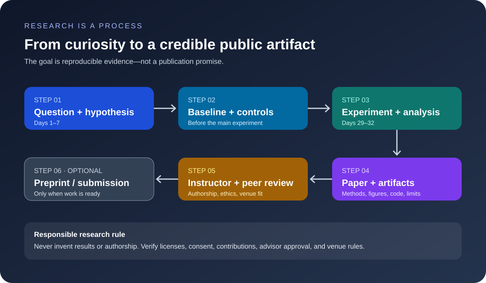

# Course 1 — LaTeX and Responsible Research Publication Guide

**Start in Week 1.** Students should not wait until the last week to learn scientific writing. Begin with a small LaTeX project, add references as you read, and let the paper draft grow alongside the experiment.



## 1. What you will create

By Day 34, every project team should have a paper-shaped report and a reproducible artifact. That does **not** mean every project is ready for public release or publication. The minimum course report includes:

1. Title and abstract (write the abstract last).
2. Problem and precise research question.
3. Related work and what gap or uncertainty remains.
4. Method and dataset provenance.
5. Experimental protocol: splits, metrics, baselines, controls, seeds and compute.
6. Results with readable figures/tables.
7. Error analysis, uncertainty and limitations.
8. Conclusion with claims no stronger than the evidence.
9. Reproducibility notes, references and artifact links.

Keep a paper draft from the start. Use comments or TODO markers for missing results; never fabricate values to make a draft look complete.

## 2. Start with LaTeX

Recommended beginner workflow:

- Use [Overleaf](https://www.overleaf.com/) if you want a browser-based editor and collaboration, or install a local LaTeX distribution and use Git.
- Keep the source in version control. A useful starter structure is:

```text
paper/
├── main.tex
├── references.bib
├── figures/
├── tables/
├── sections/
│   ├── introduction.tex
│   ├── related_work.tex
│   ├── method.tex
│   ├── experiments.tex
│   └── limitations.tex
└── README.md
```

- Add a reference when you read a paper, not at the end.
- Give every figure a caption that explains the experiment and every axis a label with units where relevant.
- Prefer vector PDF/SVG-derived PDF for diagrams and plots where practical; keep the script that generated each result figure.
- Build often. A document that compiles weekly is safer than one assembled on the deadline.
- Use the official current venue template only when you know the intended venue and have checked its current rules.

The repository includes a small generic starter at [templates/latex/course1-paper/main.tex](../templates/latex/course1-paper/main.tex) and a bibliography example at [templates/latex/course1-paper/references.bib](../templates/latex/course1-paper/references.bib).

## 3. CVPR and NeurIPS templates

These are separate venues with different formatting and submission rules. Do not assume that one template is interchangeable with the other, and do not copy a template from an old paper.

- **CVPR:** start from the current [CVPR author guidelines](https://cvpr.thecvf.com/Conferences/2026/AuthorGuidelines). Follow the current conference's official instructions and download the template/style files from the official author resources.
- **NeurIPS:** use the current [NeurIPS paper information and style files](https://neurips.cc/Conferences/2026/PaperInformation/StyleFiles). Confirm the right template for the intended submission track.
- For an initial course report, use the repository's generic starter. Convert it to the official venue template only after the instructor agrees that the scope and evidence justify preparing a submission.

**Important:** conference years, page limits, anonymity rules, supplementary-material rules and deadlines change. Always check the current official instructions before submission; this guide is a learning aid, not a replacement for venue rules.

## 4. How to build a research-grade paper

### Figures and tables

A paper figure should answer a question. For every plot, record:

- what changed between conditions;
- what was held fixed;
- dataset/split and metric;
- number of runs or uncertainty summary where appropriate;
- whether higher or lower is better;
- what conclusion the plot supports—and what it cannot establish.

Do not plot only the best seed. Do not hide failed runs. Include a baseline and use a consistent scale when comparisons depend on it.

### References and BibTeX

Use a stable citation manager or a BibTeX file. Verify author names, title, year, venue, DOI/arXiv identifier and URL against the original source. Cite the version you actually read. Never add a reference simply because it appears in another paper's bibliography.

### Reproducibility

Include the code revision, environment/dependency notes, dataset source and license, preprocessing, split policy, configuration, random seeds, compute budget and exact reproduction command. Do not publicly release data or weights unless their terms permit it.

## 5. From class project to arXiv or a conference submission

The course should make global research communication accessible, but **publication is not guaranteed and should never be promised as a grade outcome**. Many projects will be excellent learning artifacts without being novel enough for a selective conference. That is not failure.

Use this readiness gate:

- [ ] The question is precise and the related-work search establishes what is already known.
- [ ] The result is supported by a fair baseline, controlled intervention and appropriate analysis.
- [ ] Claims are calibrated; negative or inconclusive results are reported honestly.
- [ ] Data, code, figures and model use comply with licenses, privacy obligations and applicable policy.
- [ ] Every author has made a substantive contribution and has approved the final manuscript.
- [ ] The instructor/advisor has reviewed the work and agreed that public release is appropriate.
- [ ] The target venue or preprint server's current rules have been checked.

### Advisor names and authorship

Do not add a teacher's name merely because the teacher taught the course or supervised the class generally. Authorship should reflect the venue's authorship standards and actual intellectual contributions, and every named author should consent to the submission. Acknowledgment may be more appropriate than coauthorship in some cases. Confirm institutional policy and advisor expectations before posting.

### arXiv

arXiv is a preprint repository, not a peer-review acceptance process. Before submission, review the current [arXiv submission help](https://info.arxiv.org/help/submit/index.html), subject classification, endorsement requirements if applicable, license choices, and any third-party data/model constraints. A preprint can receive global visibility, but it should be shared only when the work is ready for scrutiny and all authors agree.

### CVPR / NeurIPS

A class project should target a conference only when it fits the venue and meets the scientific bar. Check novelty, strength of baselines, robustness of evidence, writing quality, ethics, anonymity and deadline feasibility with the instructor. A well-written paper is not automatically a strong paper; the evidence must carry the claim.

## 6. A weekly writing habit

- **Week 1:** create the LaTeX project, title, research question and bibliography.
- **Week 2:** write the problem statement and a first related-work outline.
- **Mid-course:** record the baseline protocol and make a placeholder results table.
- **Days 29–32:** insert actual results, figures, uncertainty, error analysis and limitations.
- **Day 30:** submit the separate critical study-report draft.
- **Day 34:** submit the final course project report/paper draft and reproducibility package.

The study report and the project report are separate deliverables. The study report critiques existing work; the project report documents the student's own investigation.
