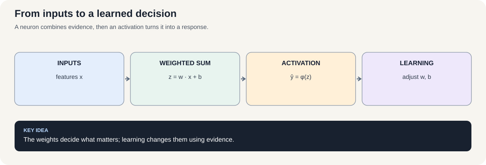
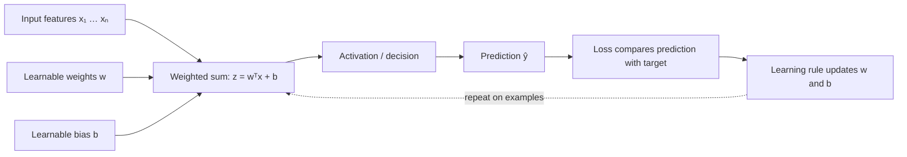
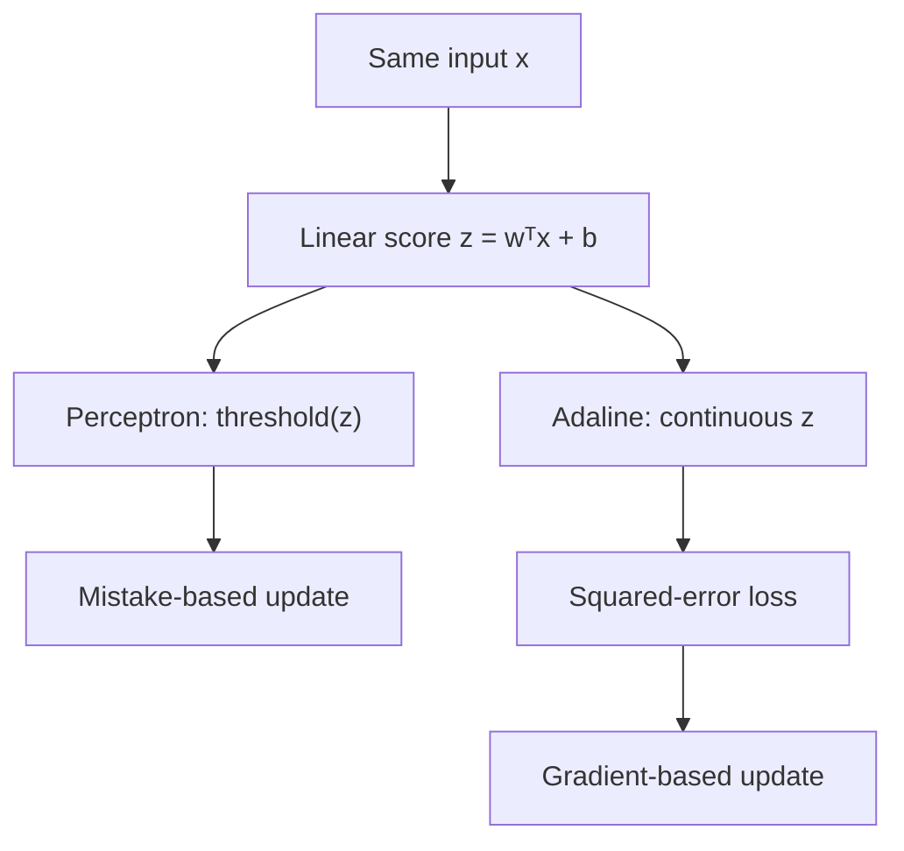

# Course 1 · Chapter 1 — Neural Computation: What Does It Mean to Learn?

**Course:** Deep Learning & Neural Computing Foundations  
**Primary laboratory:** [Open the executable laboratory](./lab.ipynb)

## Welcome: your 35-day journey

This is not a course where you wait until the final week to “do a project.” From today, you are learning how to become a researcher: first understand a mechanism, then ask a question, test it carefully, and explain what the evidence does—and does not—show.

### The calendar in one minute

- **Days 1–7 — Get started:** learn the first learning mechanisms, explore the project catalogue, begin a study report, and submit a project proposal.
- **Days 8–17 — Build foundations:** SOMs, CNNs, autoencoders and generative-model foundations; make your project question measurable.
- **Day 18 — Midterm:** individual assessment of the foundations covered in Days 1–14.
- **Days 19–28 — Expand your toolkit:** sequence models, attention/Transformers, a historical look at Boltzmann machines, and reinforcement learning.
- **Days 29–34 — Research sprint:** freeze your evaluation, run a controlled experiment, analyze failures, write, present, and submit.
- **Day 35 — Final examination:** demonstrate individual understanding and research judgment.

### How your grade is earned

| Component | Weight |
|---|---:|
| Assignments and project work | 40% |
| Critical study report | 15% |
| Midterm (Day 18) | 15% |
| Final exam (Day 35) | 30% |

The [full milestone calendar and rubric](../../../docs/ASSESSMENT_AND_MASTERY.md) explains exactly what is due and when.

### Your first research challenge

Before leaving this lecture, write down one thing about learning systems that genuinely puzzles you. It can be small: *Why does a model memorize? When does a representation help? What makes a comparison fair?* By Day 3, turn that curiosity into a candidate research question using the [project catalogue](../../../projects/06_student_research_project_catalog.md). You are not expected to have a groundbreaking idea today; you are expected to learn how to make a question precise.

You will also start writing in LaTeX early. The [LaTeX and publication guide](../../../docs/COURSE1_LATEX_AND_PUBLICATION_GUIDE.md) provides a starter template and explains how to prepare a reproducible paper draft and evaluate whether a preprint or venue submission is appropriate.

---

## Why this chapter exists

A fresher-friendly starting point: what a model is, what learning means, and why a single neuron is useful but limited.

In a real system, think of a spam filter, a medical risk screen, or a quality-control camera. The model receives measurements and must turn them into a useful decision.

By the end, you should be able to explain a perceptron, Adaline, activation, loss, gradient, and learning rate without treating any of them as magic words.

## 1. Start with a problem, not a neural network

Suppose a hospital has two measurements for each patient and wants to classify whether a simple screening rule is positive.

We have observations

$$
x=[x_1,x_2]
$$

and a binary target

$$
y\in\{0,1\}.
$$

A useful first question is not “Which neural network should we use?”

It is:

> **Can we learn a function that maps measurements to decisions from examples?**

That is the central idea behind neural computation.

A learning algorithm receives examples

$$
(x^{(1)},y^{(1)}),\ldots,(x^{(n)},y^{(n)})
$$

and searches for **parameters** that make its predictions agree with the observed targets.

A parameter is simply a number the model is allowed to learn. A weight says how strongly an input contributes; a bias shifts the result.

---

## 2. The simplest neuron

A linear neuron computes

$$
z=w_1x_1+w_2x_2+b.
$$

Here:

- $x_1,x_2$ are the input measurements;
- $w_1,w_2$ are learned weights;
- $b$ is a learned bias;
- $z$ is the score produced by the neuron.

The multiplication says “how much should this input matter?” The addition combines the contributions. The bias lets the model shift the boundary.

In vector notation,

$$
z=w^\top x+b.
$$

The symbol $w^\top x$ is just shorthand for multiplying corresponding entries and adding them:

$$
w^\top x=w_1x_1+w_2x_2.
$$

For a perceptron, the score becomes a hard decision:

$$
\hat y=
\begin{cases}
1,&z\\ge 0,\\
0,&z<0.
\end{cases}
$$

Geometrically,

$$
w^\top x+b=0
$$

is the decision boundary: a line in two dimensions, a plane in three dimensions, and a hyperplane in higher dimensions.

### Worked example

Suppose

$$
w=[2,-1],\qquad b=-0.5.
$$

For

$$
x=[1,0],
$$

the score is

$$
z=2(1)-1(0)-0.5=1.5.
$$

Because $1.5\ge 0$, the prediction is 1.

For

$$
x=[0,1],
$$

the score is

$$
z=2(0)-1(1)-0.5=-1.5,
$$

so the prediction is 0.

The neuron has not “understood medicine.” It has learned a geometric separation in the feature space.

---

## 3. Why one neuron is not enough

A single linear boundary cannot represent every useful decision.

Consider XOR:

| $x_1$ | $x_2$ | $y$ |
|---:|---:|---:|
| 0 | 0 | 0 |
| 0 | 1 | 1 |
| 1 | 0 | 1 |
| 1 | 1 | 0 |

No single straight line separates the positive examples from the negative examples.

This gives us a fundamental motivation for multilayer networks:

> **If one simple function cannot express the required mapping, compose several simple functions.**

---

## 4. Perceptron learning

The perceptron can change its parameters when it makes a mistake.

For one example, a simple update is

$$
w\leftarrow w+\eta(y-\hat y)x
$$

and

$$
b\leftarrow b+\eta(y-\hat y).
$$

### What is eta (the learning rate)?

Do not treat $\eta$ as mysterious notation.

$\eta$ is the **learning rate**. It is simply a small number controlling how large a step we take when changing the parameters.

Imagine walking downhill:

- a tiny step is safe but slow;
- a moderate step can move efficiently;
- an enormous step can jump past the useful region.

The learning rate plays the role of that step size.

If the prediction is correct, $y-\hat y=0$, so there is no update.

The important pattern is already visible:

**predict → compare → calculate a correction → change parameters → repeat.**

---

## 5. What is Adaline?

**Adaline** means **Adaptive Linear Neuron**.

It is useful because it introduces a training idea that survives all the way to modern neural networks:

> **Make a prediction, measure how wrong it is, determine which parameters would reduce that error, and change them.**

Suppose

$$
z=w^\top x+b.
$$

Adaline trains this continuous score rather than immediately converting it to 0 or 1.

For $N$ training examples, define the mean squared error:

$$
L=\frac{1}{N}\sum_{i=1}^{N}(y_i-z_i)^2.
$$

Before worrying about the formula, read it in English:

- $L$ = one number summarizing how wrong the model is;
- $y_i$ = the correct answer for example $i$;
- $z_i$ = the model's score for example $i$;
- $y_i-z_i$ = the error for that example;
- squaring makes negative and positive errors both count as error;
- the sum combines the examples;
- dividing by $N$ gives the average error.

### A concrete numerical example

Suppose

$$
x=(2,3),\qquad w=(0.5,1),\qquad b=0.5.
$$

Then

$$
z=(0.5)(2)+(1)(3)+0.5=4.5.
$$

If the target is $y=5$, the error is

$$
y-z=5-4.5=0.5.
$$

If the target is $y=10$, the error is

$$
y-z=10-4.5=5.5.
$$

The second example is much more wrong, so its squared loss is much larger. This gives the optimizer a stronger signal about how urgently the parameters need to change.

---

## 6. What is a gradient?

This is where many beginners are shown notation before being told what it means.

A **gradient is a collection of slopes**.

Imagine the loss as the height of a landscape. Your parameters determine where you are standing.

If you change one parameter slightly, does the loss go up or down? And how strongly?

For a weight $w_j$, the derivative

$$
\frac{\partial L}{\partial w_j}
$$

answers:

> **If I increase this particular weight a tiny amount, which direction does the loss move, and how strongly?**

The symbol $\partial$ means we are looking at the effect of **one variable while treating the other variables as fixed**.

The symbol $\nabla$ (“nabla”) is simply a compact way to collect these partial derivatives for all parameters.

For the vector of weights $w$,

$$
\nabla_w L =
\begin{bmatrix}
\frac{\partial L}{\partial w_1}\\
\frac{\partial L}{\partial w_2}\\
\vdots\\
\frac{\partial L}{\partial w_d}
\end{bmatrix}
$$

means:

> **the vector containing the slope of the loss with respect to every weight in $w$.**

For Adaline with one example,

$$
L=(w^\top x+b-y)^2.
$$

Differentiating with respect to the weight vector gives

$$
\nabla_w L = 2(w^\top x+b-y)x.
$$

You do not need to memorize this yet. Read it as a recipe:

1. calculate the model score $w^\top x+b$;
2. subtract the target $y$;
3. multiply by 2 because the error was squared;
4. multiply by the input vector $x$ because each weight controls the contribution of its corresponding input.

That is what the gradient is telling us.

---

## 7. Gradient descent: how do we use the gradient?

Now we have a direction telling us how the loss changes.

Suppose one weight has a **positive** gradient.

That means:

> increasing this weight would increase the loss, at least locally.

So we should move the weight in the opposite direction.

The update is

$$
w_{\text{new}} = w_{\text{old}} - \eta\nabla_w L.
$$

Read every symbol in plain English:

- $w_{\text{old}}$: where the weight is now;
- $\nabla_w L$: which way the loss increases;
- $\eta$: how large a step to take;
- minus sign: move in the opposite direction;
- $w_{\text{new}}$: the new weight after the step.

### Tiny one-dimensional example

Suppose

$$
w_{\text{old}}=2,\qquad \frac{dL}{dw}=3,\qquad \eta=0.1.
$$

Then

$$
w_{\text{new}} = 2-(0.1)(3)=1.7.
$$

Why did the weight decrease?

Because the positive slope told us that increasing $w$ would increase the loss. We therefore stepped in the opposite direction.

Now suppose the gradient were $-3$:

$$
w_{\text{new}} = 2-(0.1)(-3)=2.3.
$$

The negative gradient tells us that increasing $w$ would locally reduce the loss, so gradient descent increases the weight.

This is the entire intuition behind the update.

### What happens if the learning rate is wrong?

If $\eta$ is extremely small, learning can take many steps.

If $\eta$ is too large, the update can jump across the low-loss region and become unstable.

So the learning rate is not decorative notation. It directly controls the size of every optimization step.

---

## 8. Why this is the bridge to backpropagation

For one simple neuron, we can calculate the gradient directly.

A deep network may contain millions or billions of parameters.

The question becomes:

> **How can we efficiently calculate how each parameter contributed to the final loss?**

Backpropagation answers this using the **chain rule**.

The chain rule says that if a quantity changes through several intermediate steps, we can multiply the local changes together.

For example:

$$
w \rightarrow z \rightarrow h \rightarrow \hat y \rightarrow L.
$$

Backpropagation walks through this chain in reverse and combines the local slopes.

So:

> **Backpropagation calculates gradients. Gradient descent uses those gradients to update parameters.**

They are related, but they are not the same thing.

---

## 9. From one neuron to a network

A layer with several neurons first calculates weighted sums, then applies an activation function:

$$
h = \phi(Wx+b).
$$

Read this from the inside out:

1. $Wx$ combines the input features using learned weights;
2. $Wx+b$ adds a learned offset to each neuron's score;
3. $\phi(\cdot)$ applies the activation to those scores;
4. $h$ is the resulting vector of outputs, which can feed the next layer.

Here, $x$ is the input vector, $W$ is the weight matrix, $b$ is the bias vector, and $\phi$ is applied element by element. Common nonlinear choices include ReLU, $\phi(z)=\max(0,z)$, and sigmoid, $\phi(z)=1/(1+e^{-z})$.

### Why the activation matters mathematically

First, imagine stacking two layers **without** an activation between them. The first layer gives

$$
h_1=W_1x+b_1,
$$

and the second gives

$$
h_2=W_2h_1+b_2.
$$

Substitute the first equation into the second:

$$
\begin{aligned}
h_2 &= W_2(W_1x+b_1)+b_2\\
&= (W_2W_1)x+(W_2b_1+b_2).
\end{aligned}
$$

The result is still one **affine** transformation of $x$: it has the form $Ax+c$, where $A=W_2W_1$ and $c=W_2b_1+b_2$. (An affine function is a linear transformation plus a constant offset.) Adding more linear/affine layers only changes the effective matrix and bias; it does not create a more expressive kind of input-output function.

Now put a nonlinear activation between the layers:

$$
h_2=W_2\,\phi(W_1x+b_1)+b_2.
$$

In general, this composition cannot be represented by one affine transformation $Ax+c$. For example, ReLU bends the mapping at the point where its input crosses zero: values below zero are mapped to zero, while positive values pass through. That input-dependent bend is something a single affine transformation cannot reproduce over the whole input range. Some particular settings of the weights can still make a nonlinear network behave linearly, but the architecture is no longer restricted to linear/affine behavior.

---

## 10. Real-world connection

The same learning loop appears in very different systems:

- fraud detection learns boundaries in transaction features;
- vision models learn increasingly structured image representations;
- speech models transform acoustic patterns into linguistic representations;
- language models transform token representations through many contextual layers.

The domain changes. The underlying loop remains recognizable:

**data → computation → prediction → loss → gradient → parameter update.**

---

## 11. Laboratory: predict before you run

Open the notebook and first predict:

1. what happens when the learning rate increases;
2. what happens when labels are shuffled;
3. whether a nonlinear hidden layer can solve XOR;
4. whether the numerical gradient should agree with the analytic gradient.

Then run the experiments and record the prediction **before** seeing the result.

---

## 12. Failure analysis

Deliberately create:

- a non-linearly separable dataset;
- noisy labels;
- badly scaled features;
- an excessively large learning rate.

For each failure, answer:

**What failed: representation, optimization, data, or evaluation?**

Do not write “the model performed badly.” Name the mechanism.

---

## 13. Connection to the next chapter

A single neuron gives us a linear decision surface.

Multiple nonlinear neurons give us compositional representations.

Backpropagation gives us an efficient way to calculate gradients through those compositions.

The next chapters build on the same ideas while changing the structure of the computation.

## Mastery questions

1. What is a parameter?
2. What is a loss?
3. What does a derivative mean conceptually?
4. What does $\nabla_w L$ contain?
5. What does the learning rate control?
6. What is the difference between backpropagation and gradient descent?
7. Why do nonlinear activations matter?

### Answers

1. A learned number such as a weight or bias.
2. A scalar measuring how undesirable the model's prediction is according to the chosen objective.
3. The local rate at which one quantity changes when another changes.
4. The partial derivative of the loss with respect to every weight in $w$.
5. The size of the parameter update.
6. Backpropagation calculates gradients; gradient descent uses those gradients to change parameters.
7. Without nonlinearities, stacked linear layers collapse into one linear transformation.

## Visual intuition

*Figure: A neuron combines evidence, then an activation turns it into a response.*

— from input to decision

A neuron is a small computational pipeline. The weights decide how strongly each input matters; the bias shifts the threshold; the activation turns the score into an output.

**Perceptron vs. Adaline.** A perceptron makes a hard decision and updates from classification mistakes. Adaline trains its continuous score, so its squared-error loss changes smoothly with the parameters. This is why Adaline's learning rate can make training stable or unstable.

## Laboratory — run the experiment end to end

**[Open the executable laboratory](./lab.ipynb)**

This notebook is part of the chapter, not optional homework. Follow:

**predict → baseline → controlled change → measure → inspect failure → explain → propose next experiment.**

## Video companions

[Gradient descent, how neural networks learn](https://www.youtube.com/watch?v=IHZwWFHWa-w)

## Navigation

[← Course 1 home](../README.md) · [Next →](../02_feedforward_and_backprop/lecture.md)
