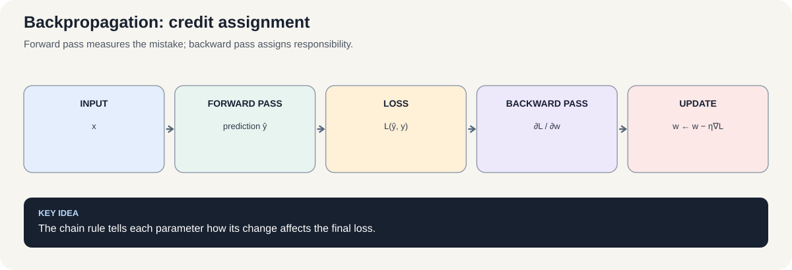
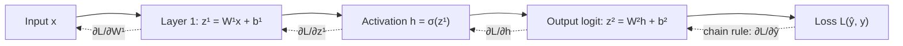

# Course 1 · Chapter 2 — Feedforward Networks and Backpropagation

**Course:** Deep Learning & Neural Computing Foundations  
**Primary laboratory:** [Open the executable laboratory](./lab.ipynb)

## Why this chapter exists

A single neuron can learn a simple boundary. But real problems often require several stages of computation.

The central question is:

> **If the final prediction is wrong, how do we know which weight should change, in which direction, and by how much?**

That is the problem of **backpropagation**.

We will build the idea from a tiny network, with actual numbers, before relying on automatic differentiation.

## 1. A problem that needs more than one neuron

Consider XOR:

| $x_1$ | $x_2$ | $y$ |
|---:|---:|---:|
| 0 | 0 | 0 |
| 0 | 1 | 1 |
| 1 | 0 | 1 |
| 1 | 1 | 0 |

No single straight line can separate the two classes.

A multilayer network can create intermediate features:

$$
h=\phi(W_1x+b_1)
$$

and then use them:

$$
\hat y=g(W_2h+b_2).
$$

Before reading the equations, understand the story:

**inputs → first computation → hidden representation → second computation → prediction.**

The hidden representation $h$ is simply a new set of numbers computed from the original input. It gives later layers a more useful representation of the problem.

## 2. Forward propagation

Consider one tiny network:

$$
x\rightarrow z_1\rightarrow h\rightarrow z_2\rightarrow\hat y.
$$

The arrow means “the output of one computation becomes the input to the next.”

Let

$$
z_1=W_1x+b_1.
$$

Then apply an activation:

$$
h=\sigma(z_1).
$$

Then another linear computation:

$$
z_2=W_2h+b_2.
$$

For binary classification, use a sigmoid at the output:

$$
\hat y=\sigma(z_2).
$$

The sigmoid is

$$
\sigma(a)=\frac{1}{1+e^{-a}}.
$$

It turns any real number into a value between 0 and 1, which we can interpret as a probability-like score.

### Work through the numbers

Suppose

$$
x=2,\quad W_1=1.5,\quad b_1=-1.
$$

Then

$$
z_1=(1.5)(2)-1=2.
$$

Therefore

$$
h=\frac{1}{1+e^{-2}}\approx0.881.
$$

Now let

$$
W_2=2,\quad b_2=-1.
$$

Then

$$
z_2=(2)(0.881)-1=0.762.
$$

Finally,

$$
\hat y=\frac{1}{1+e^{-0.762}}\approx0.682.
$$

We have just performed a complete forward pass with ordinary arithmetic.

## 3. Why nonlinear activation matters

Suppose there were no activation:

$$
h=W_1x+b_1
$$

and

$$
\hat y=W_2h+b_2.
$$

Substitute the first equation into the second:

$$
\hat y
=
W_2(W_1x+b_1)+b_2.
$$

Rearranging gives

$
\hat y=(W_2W_1)x+(W_2b_1+b_2).
$

To see why, define a new combined weight $W=W_2W_1$ and a new combined bias $b=W_2b_1+b_2$. Then the whole network is just

$
\hat y=Wx+b.
$

It has exactly the form of a single affine layer. The dimensions must match: if $x$ has $d$ features, the hidden layer has $m$ units, and the output has $k$ units, then $W_1$ is $m\times d$, $W_2$ is $k\times m$, and $W=W_2W_1$ is $k\times d$. The two layers may have more parameters internally, but without a nonlinear activation their composition still reduces to one affine transformation.

So stacking linear layers without nonlinearities does not give us the expressive power we want.

A common activation is the **rectified linear unit (ReLU)**. To avoid renderer-specific operator macros, we write its name as ordinary upright text:

$
\mathrm{ReLU}(a)=\max(0,a).
$

This means: if $a$ is positive, keep it; if $a$ is negative, output zero. For example, $\mathrm{ReLU}(3)=3$ and $\mathrm{ReLU}(-2)=0$. At exactly zero, implementations use a chosen derivative convention (commonly zero); this single point does not change the function's overall purpose.

## 4. Loss: turning a prediction into a number we can optimize

Suppose the correct target is

$$
y=1
$$

and the model predicted

$$
\hat y=0.682.
$$

Binary cross-entropy is

$$
L=
-\left[
y\log(\hat y)
+
(1-y)\log(1-\hat y)
\right].
$$

For $y=1$, this becomes

$$
L=-\log(0.682)\approx0.383.
$$

The important conceptual step is:

> **The loss converts “the model made this prediction” into “here is how undesirable that prediction was.”**

Training can now ask how to change the parameters so that the loss becomes smaller.

## 5. What is a parameter?

A parameter is simply a number the model is allowed to learn.

For this network, examples are:

$$
W_1,\quad b_1,\quad W_2,\quad b_2.
$$

The model starts with some values, usually chosen by an initialization procedure.

Training repeatedly changes these values.

So when we say:

> “The model learned a useful representation,”

we ultimately mean:

> **The training process changed its parameters so that the computation behaves differently on future inputs.**

## 6. The chain rule: the idea behind backpropagation

Suppose the loss depends on the prediction, the prediction depends on $z_2$, $z_2$ depends on $h$, and $h$ depends on $z_1$.

The dependency chain is:

$$
W_1
\rightarrow z_1
\rightarrow h
\rightarrow z_2
\rightarrow \hat y
\rightarrow L.
$$

For our one-input, one-hidden-unit, one-output example, each quantity on this path is a scalar, so the chain rule can be written as a product of local derivatives:

$$
\frac{dL}{dW_1}
=
\frac{dL}{d\hat y}
\frac{d\hat y}{dz_2}
\frac{dz_2}{dh}
\frac{dh}{dz_1}
\frac{dz_1}{dW_1}.
$$

This product is exact for the scalar example we calculate below. In a real network, a weight matrix contains many parameters and the hidden activation contains many values. The chain rule still applies, but the derivatives must respect those shapes: backpropagation combines vector-Jacobian products rather than multiplying scalar fractions blindly. Automatic differentiation computes the required products efficiently without usually constructing a giant Jacobian explicitly.

### Read the equation in English

Do not memorize the symbols first.

Read it as:

> **How much does $W_1$ affect $L$?**

Start at $W_1$ and ask:

1. If I change $W_1$, how much does $z_1$ change?
2. If $z_1$ changes, how much does the hidden activation $h$ change?
3. If $h$ changes, how much does the next logit $z_2$ change?
4. If $z_2$ changes, how much does the predicted probability $\hat y$ change?
5. If the prediction changes, how much does the loss change?

Multiplying these local sensitivities along a scalar path gives the overall sensitivity. In a multilayer network, backpropagation combines the corresponding vector/matrix derivatives across all paths that lead to the loss.

That is the heart of backpropagation.

## 7. A tiny derivative calculation

For

$$
z_1=W_1x+b_1,
$$

the derivative with respect to $W_1$ is

$$
\frac{\partial z_1}{\partial W_1}=x.
$$

Why?

Because if

$$
z_1=W_1x+b_1,
$$

then changing $W_1$ by a small amount $\Delta W_1$ changes $z_1$ by approximately

$$
\Delta z_1\approx x\,\Delta W_1.
$$

So $x$ tells us how sensitive this computation is to the weight.

This is what a derivative means: **local sensitivity**.

### Complete worked example: calculate one full backward pass

Use the same numbers as the forward pass:

$$
x=2,\quad W_1=1.5,\quad b_1=-1,\quad W_2=2,\quad b_2=-1,\quad y=1.
$$

We already calculated $z_1=2$, $h=\sigma(2)\approx0.8808$, $z_2\approx0.7616$, and $\hat y=\sigma(z_2)\approx0.6817$. For a positive target, binary cross-entropy is $L=-\log(\hat y)\approx0.3832$.

For sigmoid output plus binary cross-entropy, the derivative of the loss with respect to the output **logit** simplifies to

$$
\frac{dL}{dz_2}=\hat y-y\approx0.6817-1=-0.3183.
$$

This compact result comes from applying the chain rule to both sigmoid and cross-entropy. It is also why libraries provide a numerically stable combined loss such as BCEWithLogitsLoss.

Now propagate that error backward through the second linear layer:

$$
\frac{dL}{dW_2}=\frac{dL}{dz_2}h
\approx(-0.3183)(0.8808)=-0.2804,
\qquad
\frac{dL}{db_2}=\frac{dL}{dz_2}\approx-0.3183.
$$

The gradient with respect to the hidden activation is

$$
\frac{dL}{dh}=\frac{dL}{dz_2}W_2
\approx(-0.3183)(2)=-0.6366.
$$

For sigmoid, $\sigma'(a)=\sigma(a)(1-\sigma(a))$. Therefore

$$
\frac{dh}{dz_1}=h(1-h)\approx(0.8808)(0.1192)=0.1050.
$$

The error signal at the hidden unit is consequently

$$
\frac{dL}{dz_1}=\frac{dL}{dh}\frac{dh}{dz_1}
\approx(-0.6366)(0.1050)=-0.0668.
$$

Finally, because $z_1=W_1x+b_1$,

$$
\frac{dL}{dW_1}=\frac{dL}{dz_1}x
\approx(-0.0668)(2)=-0.1337,
\qquad
\frac{dL}{db_1}=\frac{dL}{dz_1}\approx-0.0668.
$$

**What should you notice?** The output error is not copied unchanged into every parameter. Each layer scales it by its own local sensitivity. The hidden sigmoid's derivative is about $0.105$, so the signal reaching the first layer is smaller. This is a tiny example of how gradients can shrink as they travel through many layers.

With learning rate $\eta=0.1$, gradient descent would increase both weights in this example because both weight gradients are negative:

$$
W_2^{\mathrm{new}}=2-0.1(-0.2804)\approx2.0280,
\qquad
W_1^{\mathrm{new}}=1.5-0.1(-0.1337)\approx1.5134.
$$

This update is only one step on one example; it does not guarantee the loss will decrease for an arbitrarily large learning rate or for the whole dataset.

## 8. From gradients to parameter updates

Once backpropagation has calculated a gradient, an optimizer can use it.

For one parameter $\theta$:

$$
\theta_{\text{new}}
=
\theta_{\text{old}}
-
\eta
\frac{\partial L}{\partial\theta}.
$$

Here:

- $\theta$ means “the particular parameter we are updating”;
- $\frac{\partial L}{\partial\theta}$ says how the loss changes if that parameter changes;
- $\eta$ is the learning rate, the size of our step;
- the minus sign says “move against the slope.”

For many parameters, we write the same idea compactly as

$$
\theta_{\text{new}}
=
\theta_{\text{old}}
-
\eta\nabla_\theta L.
$$

Here $\nabla_\theta L$ is just a vector containing all those individual partial derivatives.

### Tiny numerical example

Suppose

$$
\theta_{\text{old}}=2,
\qquad
\frac{\partial L}{\partial\theta}=3,
\qquad
\eta=0.1.
$$

Then

$$
\theta_{\text{new}}
=
2-(0.1)(3)
=
1.7.
$$

If the gradient were $-3$ instead:

$$
\theta_{\text{new}}
=
2-(0.1)(-3)
=
2.3.
$$

The gradient tells us the direction; the learning rate tells us how far to move.

## 9. Backpropagation is not gradient descent

These two ideas are often incorrectly treated as one thing.

**Backpropagation** calculates gradients efficiently by applying the chain rule backward through the computation graph.

**Gradient descent** uses those gradients to change the parameters.

So the training loop is:

**forward pass → loss → backpropagation → gradients → optimizer update → repeat.**

This distinction becomes essential when we later replace basic gradient descent with Adam, AdamW, momentum methods, or other optimizers.

## 10. Mini-batches

A single example can give a noisy estimate of the direction that reduces loss.

For a mini-batch $B$, the average loss can be written as

$$
L_B=
\frac{1}{|B|}
\sum_{i\in B}L_i.
$$

The corresponding gradient is the average of the example gradients:

$$
\nabla_\theta L_B
=
\frac{1}{|B|}
\sum_{i\in B}
\nabla_\theta L_i.
$$

Larger batches often make this estimate less noisy, but they also require more memory and can change optimization behavior.

The engineering question is not “What is the biggest batch?”

It is:

> **What batch size gives useful optimization behavior within our memory and throughput budget?**

## 11. Memorization versus generalization

A network can make training loss extremely small and still perform poorly on unseen examples.

For example:

| Run | Training accuracy | Validation accuracy |
|---|---:|---:|
| smaller model | 91% | 89% |
| larger model | 100% | 88% |

The larger model fit the training data better but did not generalize better.

Possible explanations include overfitting, insufficient data, distribution mismatch, or optimization differences.

Do not choose the explanation first. Design an experiment that distinguishes them.

## Training dynamics: initialization, optimizer, normalization, and regularization

A gradient tells us which direction locally increases the loss. An optimizer decides how to use that information over many updates. It cannot rescue every bad setup, and a single run cannot tell us which choice is universally best.

### Initialization: where learning begins

At the start, the network's weights need initial values. If every neuron in a layer starts with exactly the same weights, they receive the same gradient and can learn the same feature; this is the symmetry problem. Random initialization breaks that symmetry. The scale matters too: weights that are too large can push activations into saturated regions or make gradients unstable; weights that are too small can shrink signals as they pass through layers. Xavier/Glorot and He initialization choose scales based on layer width and activation family.

### SGD, momentum, and Adam

- **SGD:** $w\leftarrow w-\eta g_t$. It moves opposite the current gradient $g_t$, scaled by learning rate $\eta$.
- **Momentum:** keeps a running direction so consistent gradients accumulate and noisy reversals are damped. A common form is $m_t=\beta m_{t-1}+g_t$, then $w\leftarrow w-\eta m_t$.
- **Adam:** tracks moving averages of gradients and squared gradients, then scales each parameter's update using both. This can make optimization less sensitive to different gradient magnitudes across parameters, but it still needs sensible learning rates and validation.

These methods differ in their update rule—not in the loss they are trying to minimize. Compare them with the same architecture, initialization, data order, training budget, and evaluation split. A faster decrease in training loss does not automatically mean better held-out performance.

### Normalization: make the scale of inputs manageable

Feature scaling changes the numerical units seen by the optimizer. If one feature ranges from 0 to 1 and another ranges from 0 to 100,000, their contributions can create badly conditioned optimization. Standardization uses

$$
x'=\frac{x-\mu_{\mathrm{train}}}{\sigma_{\mathrm{train}}}.
$$

The mean and standard deviation must be estimated from training data only, then reused unchanged for validation and test data. Fitting the scaler on all examples leaks information from the held-out set.

Batch normalization instead normalizes intermediate activations using batch statistics during training and tracked statistics at inference. It is a model-layer technique, not a replacement for a leakage-safe data split.

### Regularization: discourage fitting accidental details

Weight decay adds a penalty for large weights, commonly written

$$
\mathcal L_{\mathrm{total}}=\mathcal L_{\mathrm{data}}+\lambda\|w\|_2^2.
$$

The coefficient $\lambda$ controls the trade-off: a stronger penalty may reduce overfitting but can also underfit. Dropout randomly masks some activations during training, discouraging the network from depending too heavily on one path. Neither technique is guaranteed to help; choose its strength using validation data, not the final test set.

**Controlled experiment rule:** first compare SGD with Adam while holding everything else fixed. Then, in a separate experiment, compare weight decay off versus on with the optimizer fixed. If you change optimizer, regularization, width, and epochs simultaneously, you will not know which change caused the result.

## 12. Numerical gradient checking

One of the best debugging tools in deep learning is to compare two independent calculations.

For a parameter $\theta$, approximate the derivative using a tiny perturbation $\epsilon$:

$$
\frac{\partial L}{\partial\theta}
\approx
\frac{
L(\theta+\epsilon)-L(\theta-\epsilon)
}{
2\epsilon
}.
$$

Conceptually:

1. move the parameter slightly upward;
2. measure the loss;
3. move it slightly downward;
4. measure the loss again;
5. compare the change with the gradient produced by backpropagation.

If the two agree closely, your derivative implementation is probably correct.

If they disagree substantially, investigate the implementation before training a larger model.

## 13. Real-world connection

Feedforward networks are useful for tabular prediction, risk scoring, anomaly detection, sensor classification, and projection heads.

More importantly, the same ideas appear inside modern systems:

**parameters → forward computation → loss → gradients → update.**

CNNs change the computation to exploit spatial structure. RNNs introduce recurrent state. Transformers introduce attention.

The training logic remains recognizable.

## 14. Laboratory

Before running the notebook, predict:

- what happens when the learning rate changes;
- whether the analytic and numerical gradients agree;
- how width changes parameter count;
- what shuffled labels do to validation performance.

Then:

1. implement a two-layer network from scratch;
2. verify gradients numerically;
3. train the same task with autograd;
4. compare optimization settings;
5. change width or depth;
6. run a shuffled-label control;
7. inspect individual errors.

## 15. Failure analysis

Deliberately try:

- an excessively large learning rate;
- a broken gradient;
- shuffled labels;
- a train/validation split with leakage.

For every failure, identify whether the problem is in:

**data → model → gradient → optimizer → evaluation.**

## 16. Research extension

Choose one controlled comparison:

- width at fixed parameter budget;
- depth at fixed parameter budget;
- optimizer at fixed compute;
- batch size at fixed example budget;
- initialization under controlled seeds;
- regularization under fixed architecture.

State the hypothesis before running the experiment.

## Mastery questions

1. What does a derivative mean conceptually?
2. Why does the chain rule matter?
3. What does backpropagation calculate?
4. What does gradient descent do with those gradients?
5. What does the learning rate control?
6. Why can a large model have higher training accuracy but lower validation accuracy?
7. What does a numerical gradient check test?

### Answers

1. A local sensitivity: how much one quantity changes when another changes.
2. It lets us combine local sensitivities along a computation chain.
3. Gradients of the loss with respect to model parameters.
4. It changes parameters in the direction intended to reduce the loss.
5. The size of the parameter update.
6. Greater capacity can fit training-specific patterns without improving generalization.
7. It compares an independent finite-difference estimate with the analytic/backpropagated gradient.

## Visual intuition

*Figure: Forward pass measures the mistake; backward pass assigns responsibility.*

— how a multilayer network learns

The forward pass carries information from input to prediction. Backpropagation sends information about the error in the opposite direction, using the chain rule to calculate how each parameter affected the loss. Gradient descent then uses those gradients to update parameters.

The backward arrows are **not** the model making a second prediction. They carry derivatives. A derivative answers: *if I changed this quantity by a tiny amount, how would the loss change?* The optimizer applies the update only after these derivatives have been calculated.

## Laboratory — run the experiment end to end

**[Open the executable laboratory](./lab.ipynb)**

Follow:

**predict → baseline → controlled change → measure → inspect failure → explain → propose next experiment.**

## Video companions

[Backpropagation, intuitively](https://www.youtube.com/watch?v=Ilg3gGewQ5U) · [Backpropagation calculus](https://www.youtube.com/watch?v=tIeHLnjs5U8)

## Navigation

[← Previous](../01_neural_computing_foundations/lecture.md) · [Course 1 home](../README.md) · [Next →](../03_competitive_learning_and_som/lecture.md)
