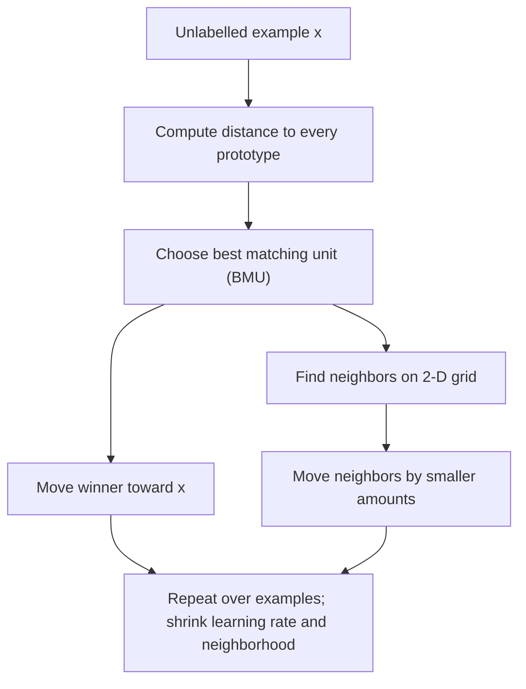

# Course 1 · Chapter — Competitive Learning and Self-Organizing Maps

**Course:** Deep Learning & Neural Computing Foundations  
**Primary laboratory:** [Open the executable laboratory](./lab.ipynb)

## Why this chapter exists

Not every problem has labels. Sometimes we want a model to discover structure: customer groups, sensor patterns, or regions of a feature space.

Competitive learning asks which prototype is closest, then moves that prototype toward the example. A SOM adds neighborhood structure so nearby prototypes learn related patterns.

The lab turns this into a measurable clustering experiment rather than a historical algorithm tour.

## Learning objective

By the end of this unit, the learner should be able to explain the mechanism mathematically, implement a minimal version without a high-level abstraction, use a modern library implementation, and design a controlled experiment showing when the method helps or fails.

## Teaching walkthrough

Start with a clustering problem where labels do not exist. Competitive learning asks which prototype is closest to an input and lets that prototype move toward the example. For SOM, the winner is not alone: nearby units move too, creating a topology-preserving map.

For an input x and prototype w_j, choose
j* = argmin_j ||x-w_j||².
Then update the winner:
w_j* ← w_j* + η(x-w_j*).
SOM extends this with a neighborhood h(j,j*,t):
w_j ← w_j + η h(j,j*,t)(x-w_j).

The important intuition is that learning is simultaneously doing two things: fitting prototypes to data and organizing nearby prototypes to represent nearby regions of the input space.

Worked example: place four 2-D prototypes on the corners of a square and feed points from two clusters. Calculate the winner for one point and move the winner. Then activate its neighbors and observe how the map changes.

Real connection: SOMs are useful for exploratory visualization, sensor regimes, customer segmentation, and inspecting high-dimensional structure. They are not magic clustering algorithms; topology preservation and neighborhood choices matter.

Failure experiment: create two clusters with very different densities. Ask whether the map represents density faithfully or spreads prototypes according to its training dynamics.

## Build the intuition before the notation

Imagine putting several magnets on a table and dropping a point onto the table. The closest magnet is responsible for that point. If we move the winning magnet slightly toward the point, repeated observations gradually place magnets in useful regions.

That is the whole competitive-learning story.

The notation only names the pieces:

- $x$ = today's observation;
- $w_j$ = prototype $j$;
- $\arg\min$ = choose the closest prototype;
- $\eta$ = how far the winner moves;
- $h$ = how strongly neighboring SOM units participate.

### Why this is different from k-means

Competitive learning and k-means look related because both use prototypes. But their training procedures and objectives are not identical.

K-means repeatedly alternates between assignment and centroid recomputation. Online competitive learning updates a winner incrementally. A SOM additionally cares about the geometry of the prototype grid.

So do not say “SOM is just k-means with a picture.” The neighborhood update creates a different inductive bias.

### Experiment prediction

Before opening the notebook, write down three predictions:

1. prototype learning should lower quantization error;
2. changing neighborhood width should change the geometry of the map;
3. using labels during training would turn this into a different, supervised problem.

Then run the notebook and mark each prediction **supported / contradicted / inconclusive**. This makes the lab an experiment rather than a code-reading exercise.

## A researcher's checklist

When an unsupervised visualization looks compelling, ask:

- Does the result survive a new random seed?
- Does changing map size change the story?
- Does standardization change the story?
- Is the metric consistent with the visual interpretation?
- Would another clustering method produce the same structure?
- Are we interpreting labels after the fact?

A good unsupervised result survives several of these questions.

## Core concepts

This unit covers **winner-take-all, SOM topology, Evolving SOM, representation discovery**. Do not memorize the architecture. Derive the computation, identify its inductive bias, and ask what evidence would distinguish its claimed advantage from a larger parameter count or better optimization.

## Required practical workflow

1. Load the real dataset in the lab and record its provenance, split, schema, license/access basis, and revision/date.
2. Build the smallest defensible baseline.
3. Implement the central mechanism once from first principles.
4. Run the framework implementation.
5. Keep the primary budget fixed while changing one factor.
6. Measure quality, compute, memory, and failure modes.
7. Repeat with seeds when feasible and report uncertainty.
8. Inspect qualitative examples—not only aggregate metrics.
9. Write a short interpretation that separates observation from explanation.
10. Propose the next falsifiable experiment.

## Research exercise

The lab must end with a research question. A good question has a measurable independent variable, a defined outcome, a baseline, and a reason the result would matter. Examples include:

- Does the mechanism improve accuracy at the same parameter count?
- Does it improve sample efficiency at the same training budget?
- Does it improve robustness under distribution shift?
- Does it reduce inference memory or latency?
- Which failure mode becomes more or less common?

## Paper-ready deliverable

Every learner produces a **mini research package**: hypothesis, related-work note, dataset card, method description, experiment matrix, baseline, results table, one figure, error analysis, limitations, reproducibility block, and next-work proposal. These artifacts accumulate toward the final publication capstone.

## Exit questions

1. What problem does the method solve?
2. What inductive bias does it introduce?
3. Which tensor operations implement it?
4. What is the simplest credible baseline?
5. Which metric and split answer the research question?
6. What failure would falsify your hypothesis?

## Visual intuition — prototypes and the map neighborhood

Competitive learning asks which prototype is closest to the current example; only the winner moves. A self-organizing map (SOM) also moves neighboring units, with the winner moving most and distant map cells moving less. The grid is a neighborhood structure, not a label map supplied by a teacher.

A useful SOM visualization should show **both** the map and a quantitative measure. Quantization error measures how far examples are from their best matching prototype; it does not, by itself, prove that the map preserves neighborhoods or discovers meaningful classes.

## Laboratory

The notebook is intentionally part of this lecture. It uses a real dataset and requires a baseline, controlled intervention, ablation/error analysis, and a paper-ready result rather than a “hello world” demo.

[← Previous](../02_feedforward_and_backprop/lecture.md) · [Course 1 home](../README.md) · [Next →](../04_convolutional_networks/lecture.md)

## Laboratory — run the experiment end to end

**[Open the executable laboratory](./lab.ipynb)**

This notebook is part of the chapter, not optional homework. Follow the same scientific loop used in real ML work:

**predict → establish a baseline → run → change one factor → measure → inspect failures → produce the results table → conclude → propose the next experiment.**

The notebook uses a real dataset or environment, records quantitative results, and ends with an answer key and a research extension.

## Video companions

[Video companions: competitive learning and self-organizing maps](https://www.youtube.com/results?search_query=self+organizing+maps+competitive+learning+lecture)

## Navigation

[← Previous](../02_feedforward_and_backprop/lecture.md) · [Course 1 home](../README.md) · [Next →](../04_convolutional_networks/lecture.md)
