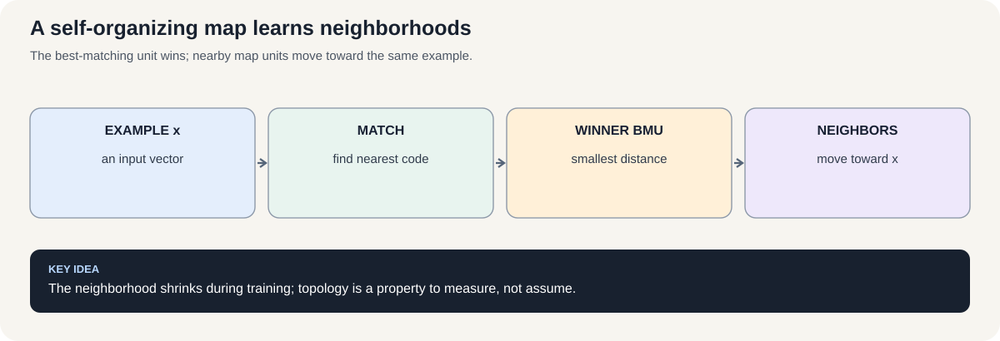
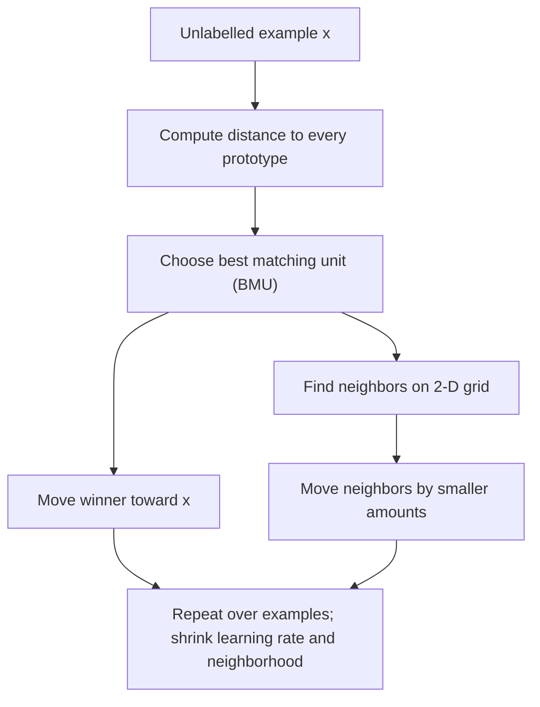

# Course 1 · Chapter 3 — Competitive Learning and Self-Organizing Maps

**Course:** Deep Learning & Neural Computing Foundations  
**Primary laboratory:** [Open the executable laboratory](./lab.ipynb)

## Why this chapter exists

Not every problem has labels. Sometimes we want a model to discover structure: customer groups, sensor patterns, or regions of a feature space.

Competitive learning asks which prototype is closest, then moves that prototype toward the example. A SOM adds neighborhood structure so nearby prototypes learn related patterns.

The lab turns this into a measurable clustering experiment rather than a historical algorithm tour.

## Learning objective

By the end of this unit, the learner should be able to explain the mechanism mathematically, implement a minimal version without a high-level abstraction, use a modern library implementation, and design a controlled experiment showing when the method helps or fails.

## Teaching walkthrough

Start with a clustering problem where labels do not exist. Competitive learning asks which prototype is closest to an input and lets that prototype move toward the example. For SOM, the winner is not alone: nearby units move too, creating a topology-preserving map.

For an input vector $x$ and prototype $w_j$, first find the **best-matching unit (BMU)**: the prototype with the smallest squared Euclidean distance to the input.

$$
j^* = \arg\min_j \|x-w_j\|_2^2.
$$

The winner then moves a fraction of the way toward the input:

$$
w_{j^*}^{\text{new}} = w_{j^*}^{\text{old}} + \eta\left(x-w_{j^*}^{\text{old}}\right).
$$

Here, $x-w_{j^*}$ is the direction from the winning prototype to the example, and the learning rate $\eta$ controls how far the prototype moves. If $\eta=0$, it does not move; if $\eta=1$, it jumps directly to the example for this update.

A self-organizing map (SOM) also moves nearby grid units. Let $h(j,j^*,t)$ be the neighborhood strength for unit $j$ around the winner at training step $t$:

$$
w_j^{\text{new}} = w_j^{\text{old}} + \eta\,h(j,j^*,t)\left(x-w_j^{\text{old}}\right).
$$

The winner usually has neighborhood strength near 1, while farther units receive smaller values (often 0). The neighborhood radius typically shrinks over training.

The important intuition is that learning is simultaneously doing two things: fitting prototypes to data and organizing nearby prototypes to represent nearby regions of the input space.

Worked example: place four 2-D prototypes on the corners of a square and feed points from two clusters. Calculate the winner for one point and move the winner. Then activate its neighbors and observe how the map changes.

Real connection: SOMs are useful for exploratory visualization, sensor regimes, customer segmentation, and inspecting high-dimensional structure. They are not magic clustering algorithms; topology preservation and neighborhood choices matter.

Failure experiment: create two clusters with very different densities. Ask whether the map represents density faithfully or spreads prototypes according to its training dynamics.

## Build the intuition before the notation

Imagine putting several magnets on a table and dropping a point onto the table. The closest magnet is responsible for that point. If we move the winning magnet slightly toward the point, repeated observations gradually place magnets in useful regions.

That is the whole competitive-learning story.

The notation only names the pieces:

- $x$ = today's observation;
- $w_j$ = prototype $j$;
- $\arg\min$ = choose the closest prototype;
- $\eta$ = how far the winner moves;
- $h$ = how strongly neighboring SOM units participate.

### Why this is different from k-means

Competitive learning and k-means look related because both use prototypes. But their training procedures and objectives are not identical.

K-means repeatedly alternates between assignment and centroid recomputation. Online competitive learning updates a winner incrementally. A SOM additionally cares about the geometry of the prototype grid.

So do not say “SOM is just k-means with a picture.” The neighborhood update creates a different inductive bias.

### What an Evolving SOM adds

A fixed-size SOM starts with a predefined grid. An **Evolving SOM (ESOM)** family allows the representation structure to adapt as data arrive. Depending on the specific algorithm, it may add units in regions with persistent quantization error, adjust connections, or remove units that contribute little. There is no single universal ESOM update rule, so an experiment must name the variant and state its growth/pruning rule rather than treating “evolving” as one standardized algorithm.

A practical comparison should hold the data preprocessing and evaluation protocol fixed, then compare:
- fixed-size SOM with a declared grid size;
- the named evolving variant with its growth/pruning thresholds;
- a simple baseline such as k-means when clustering quality is the question.

Report quantization error and resource use, inspect the map, and check sensitivity to initialization. An evolving map may fit changing structure better, but it can also grow unnecessarily, overreact to noise, or make comparisons unfair if allowed much more capacity.

### Experiment prediction

Before opening the notebook, write down three predictions:

1. prototype learning should lower quantization error;
2. changing neighborhood width should change the geometry of the map;
3. using labels during training would turn this into a different, supervised problem.

Then run the notebook and mark each prediction **supported / contradicted / inconclusive**. This makes the lab an experiment rather than a code-reading exercise.

## A researcher's checklist

When an unsupervised visualization looks compelling, ask:

- Does the result survive a new random seed?
- Does changing map size change the story?
- Does standardization change the story?
- Is the metric consistent with the visual interpretation?
- Would another clustering method produce the same structure?
- Are we interpreting labels after the fact?

A good unsupervised result survives several of these questions.

## Work a winner-take-all update by hand

Let the input be \(x=(0.2,0.8)\), and suppose two map units have prototypes \(w_1=(0,1)\) and \(w_2=(1,0)\). A simple SOM first finds the **best-matching unit (BMU)** by Euclidean distance.

\[
d(x,w_1)=\sqrt{(0.2-0)^2+(0.8-1)^2}\approx0.283,
\]
\[
d(x,w_2)=\sqrt{(0.2-1)^2+(0.8-0)^2}\approx1.131.
\]

Unit 1 wins because its prototype is closer to the example. A basic competitive update moves the winner toward the input:

\[
w_1'=w_1+\eta(x-w_1).
\]

With learning rate \(\eta=0.5\), \(w_1'=(0.1,0.9)\). A SOM also moves neighboring map units, but by a smaller amount determined by their distance from the BMU on the map grid. That neighborhood update is what distinguishes a SOM from winner-take-all clustering.

The learning rate and neighborhood radius usually shrink over training. Early updates organize broad structure; later updates refine local placement. But a visually attractive map does not prove that its topology is meaningful. Inspect quantization error and a neighborhood-preservation measure, and compare against a simple baseline.

**Check yourself:** if both prototypes were equally distant from the input, what tie-breaking rule would your implementation use? Why should that choice be deterministic for reproducible experiments?

## Core concepts

This unit covers **winner-take-all, SOM topology, Evolving SOM, representation discovery**. Do not memorize the architecture. Derive the computation, identify its inductive bias, and ask what evidence would distinguish its claimed advantage from a larger parameter count or better optimization.

## Required practical workflow

1. Load the real dataset in the lab and record its provenance, split, schema, license/access basis, and revision/date.
2. Build the smallest defensible baseline.
3. Implement the central mechanism once from first principles.
4. Run the framework implementation.
5. Keep the primary budget fixed while changing one factor.
6. Measure quality, compute, memory, and failure modes.
7. Repeat with seeds when feasible and report uncertainty.
8. Inspect qualitative examples—not only aggregate metrics.
9. Write a short interpretation that separates observation from explanation.
10. Propose the next falsifiable experiment.

## Research exercise

The lab must end with a research question. A good question has a measurable independent variable, a defined outcome, a baseline, and a reason the result would matter. Examples include:

- Does the mechanism improve accuracy at the same parameter count?
- Does it improve sample efficiency at the same training budget?
- Does it improve robustness under distribution shift?
- Does it reduce inference memory or latency?
- Which failure mode becomes more or less common?

## Paper-ready deliverable

Every learner produces a **mini research package**: hypothesis, related-work note, dataset card, method description, experiment matrix, baseline, results table, one figure, error analysis, limitations, reproducibility block, and next-work proposal. These artifacts accumulate toward the final publication capstone.

## Exit questions

1. What problem does the method solve?
2. What inductive bias does it introduce?
3. Which tensor operations implement it?
4. What is the simplest credible baseline?
5. Which metric and split answer the research question?
6. What failure would falsify your hypothesis?

## Visual intuition

*Figure: The best-matching unit wins; nearby map units move toward the same example.*

— prototypes and the map neighborhood

Competitive learning asks which prototype is closest to the current example; only the winner moves. A self-organizing map (SOM) also moves neighboring units, with the winner moving most and distant map cells moving less. The grid is a neighborhood structure, not a label map supplied by a teacher.

A useful SOM visualization should show **both** the map and a quantitative measure. Quantization error measures how far examples are from their best matching prototype; it does not, by itself, prove that the map preserves neighborhoods or discovers meaningful classes.

## Laboratory — run the experiment end to end

**[Open the executable laboratory](./lab.ipynb)**

This notebook is part of the chapter, not optional homework. Follow the same scientific loop used in real ML work:

**predict → establish a baseline → run → change one factor → measure → inspect failures → produce the results table → conclude → propose the next experiment.**

The notebook uses a real dataset or environment, records quantitative results, and ends with an answer key and a research extension.

## Video companions

**Recommended starting point:** [Self-Organizing Maps — lecture, examples, and implementation](https://www.youtube.com/watch?v=OJT_57s0SHo)

For a broader selection, [browse more Self-Organizing Maps videos](https://www.youtube.com/results?search_query=Self-Organizing+Maps).

## Navigation

[← Previous](../02_feedforward_and_backprop/lecture.md) · [Course 1 home](../README.md) · [Next →](../04_convolutional_networks/lecture.md)
