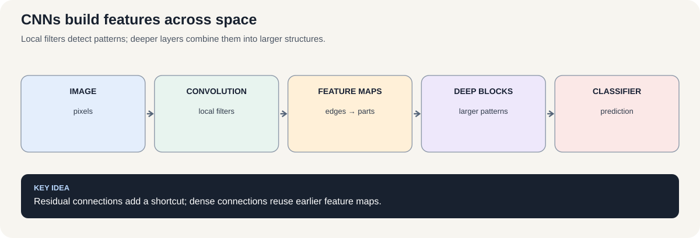
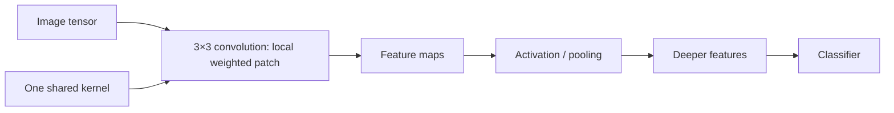
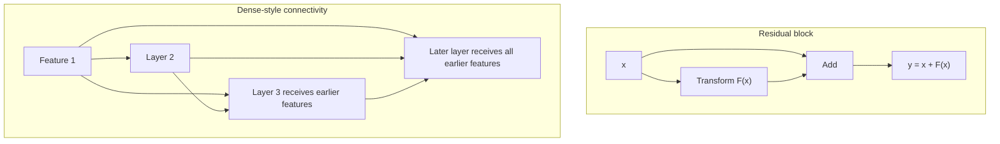

# Course 1 · Chapter — Convolutional Networks, Residual Learning, and Dense Connections

**Course:** Deep Learning & Neural Computing Foundations  
**Primary laboratory:** [Open the executable laboratory](./lab.ipynb)

## Why this chapter exists

Images contain local structure: edges, corners, textures, and shapes. Convolution builds that prior directly into the model.

A convolution kernel is a small set of shared weights that scans an image. Residual connections then make deeper networks easier to optimize by giving information a shortcut path.

You will connect parameter sharing, receptive fields, residuals, and actual image accuracy.

## Learning objective

By the end of this unit, the learner should be able to explain the mechanism mathematically, implement a minimal version without a high-level abstraction, use a modern library implementation, and design a controlled experiment showing when the method helps or fails.

## Teaching walkthrough

Start with the image problem: a detector for an edge should not need a completely different parameter for every pixel location. Convolution introduces a useful inductive bias: the same local detector can be reused across positions.

For a 1-D illustration,
y_i = Σ_k w_k x_{i+k}.
In 2-D the same idea becomes a sliding kernel over height and width. A feature map therefore answers questions such as “where does this learned pattern occur?”

Explain stride, padding, receptive field, channels, and parameter sharing with a 5×5 image and a 3×3 kernel. Count the parameters explicitly and compare them with a fully connected layer.

Then explain depth: early layers can detect edges/textures, later layers can combine them into more complex patterns. Residual networks change the optimization problem by learning a residual:
y = F(x) + x.
The shortcut gives information and gradients a direct path.

Dense networks instead concatenate earlier representations:
x_l = H_l([x_0,...,x_{l-1}]).

Real connection: CNNs power visual inspection, medical imaging, OCR, satellite imagery, and many multimodal encoders.

Failure experiment: compare a CNN with and without augmentation under a controlled background shift. Ask whether the model learned the object or a shortcut.

## Build the intuition before the notation

Imagine looking for the same type of edge everywhere in a photograph. A dense layer could learn a separate detector for every location. A convolution says something more sensible:

> “If this pattern matters here, it may matter somewhere else too.”

That is **translation-aware parameter sharing**.

The kernel is therefore not merely a smaller matrix. It is a statement about what kinds of relationships the model expects to find useful.

### A concrete parameter-count exercise

For a $28\times28$ grayscale image, compare:

- dense layer: $784\rightarrow64$;
- convolution: 16 filters of size $3\times3$.

The dense layer has:

$
784\times64+64=50,240
$

parameters.

The convolution has:

$
16(3\times3+1)=160.
$

The dramatic difference comes from two assumptions:

1. each filter looks locally;
2. the same filter is reused at every location.

Neither assumption is universally correct. That is why controlled experiments matter.

### Receptive field thought experiment

A single $3\times3$ convolution sees a $3\times3$ neighborhood.

Two stride-1 $3\times3$ layers can combine information from a larger region. Stacking local operations therefore gradually builds a wider effective context.

This gives a useful mental progression:

**local pixels → local patterns → combinations of patterns → larger structures.**

### Why residual connections matter mathematically

If a block learns $F(x)$, ordinary learning asks it to produce the entire transformed representation.

A residual block asks it to produce a correction:

$
F(x)=y-x.
$

If the best transformation is close to identity, the desired correction is small.

The shortcut therefore changes what the block must learn, not merely how many parameters it contains.

### Research habit

Whenever comparing CNN architectures, report parameter count and training budget. Otherwise “Model B is better” may simply mean Model B was given more capacity or more optimization.

## Work a small example by hand

Consider this (3\times3) input and a (2\times2) filter. For clarity, we use **cross-correlation** (the operation most deep-learning libraries call convolution): slide the filter without flipping it.

[
X=\begin{bmatrix}1&2&0\\0&1&3\\2&1&0\end{bmatrix},
\qquad
K=\begin{bmatrix}1&0\\0&-1\end{bmatrix}.
]

At the upper-left position, multiply matching entries and add:

[
1(1)+2(0)+0(0)+1(-1)=0.
]

Move the filter one column right:

[
2(1)+0(0)+1(0)+3(-1)=-1.
]

Repeat for the bottom row. The output feature map is

[
Y=\begin{bmatrix}0&-1\\-1&1\end{bmatrix}.
]

Every output cell is a local weighted measurement. The same four filter weights are reused at all four positions. This is the heart of parameter sharing.

### Predict the output shape before running code

For input height (H), kernel size (K), padding (P), and stride (S), the output height is

[
H_{out}=\left\lfloor\frac{H+2P-K}{S}\right\rfloor+1.
]

For a (28\times28) image, (3\times3) kernel, stride 1, and padding 1, the output stays (28\times28). Sixteen filters produce 16 output channels.

A residual block makes a different numerical move: if (x=2.0) and the learned correction (F(x)=0.2), then (y=x+F(x)=2.2). The block can preserve the original representation while learning a correction. A dense block instead concatenates features, so feature dimensions grow as earlier maps are reused.

**Check yourself:** what would happen to the output size if the stride changed from 1 to 2? Before coding, calculate it using the formula and explain why rounding down is needed.

## Core concepts

This unit covers **convolution, pooling, receptive fields, CNN extensions, residual and dense networks**. Do not memorize the architecture. Derive the computation, identify its inductive bias, and ask what evidence would distinguish its claimed advantage from a larger parameter count or better optimization.

## Required practical workflow

1. Load the real dataset in the lab and record its provenance, split, schema, license/access basis, and revision/date.
2. Build the smallest defensible baseline.
3. Implement the central mechanism once from first principles.
4. Run the framework implementation.
5. Keep the primary budget fixed while changing one factor.
6. Measure quality, compute, memory, and failure modes.
7. Repeat with seeds when feasible and report uncertainty.
8. Inspect qualitative examples—not only aggregate metrics.
9. Write a short interpretation that separates observation from explanation.
10. Propose the next falsifiable experiment.

## Research exercise

The lab must end with a research question. A good question has a measurable independent variable, a defined outcome, a baseline, and a reason the result would matter. Examples include:

- Does the mechanism improve accuracy at the same parameter count?
- Does it improve sample efficiency at the same training budget?
- Does it improve robustness under distribution shift?
- Does it reduce inference memory or latency?
- Which failure mode becomes more or less common?

## Paper-ready deliverable

Every learner produces a **mini research package**: hypothesis, related-work note, dataset card, method description, experiment matrix, baseline, results table, one figure, error analysis, limitations, reproducibility block, and next-work proposal. These artifacts accumulate toward the final publication capstone.

## Exit questions

1. What problem does the method solve?
2. What inductive bias does it introduce?
3. Which tensor operations implement it?
4. What is the simplest credible baseline?
5. Which metric and split answer the research question?
6. What failure would falsify your hypothesis?

## Visual intuition

*Figure: Local filters detect patterns; deeper layers combine them into larger structures.*

— local filters, shared weights, and skip paths

A convolutional filter looks at a small patch and reuses the same weights at many image locations. This encodes the assumption that a useful local pattern—such as an edge—may matter wherever it appears.

Residual and dense connections address a different question: how should information move through a deep stack?

## Laboratory — run the experiment end to end

**[Open the executable laboratory](./lab.ipynb)**

This notebook is part of the chapter, not optional homework. Follow the same scientific loop used in real ML work:

**predict → establish a baseline → run → change one factor → measure → inspect failures → produce the results table → conclude → propose the next experiment.**

The notebook uses a real dataset or environment, records quantitative results, and ends with an answer key and a research extension.

## Video companions

[Video companions: CNNs, residual networks and dense networks](https://www.youtube.com/results?search_query=CNN+ResNet+DenseNet+lecture)

## Navigation

[← Previous](../03_competitive_learning_and_som/lecture.md) · [Course 1 home](../README.md) · [Next →](../05_autoencoders/lecture.md)
