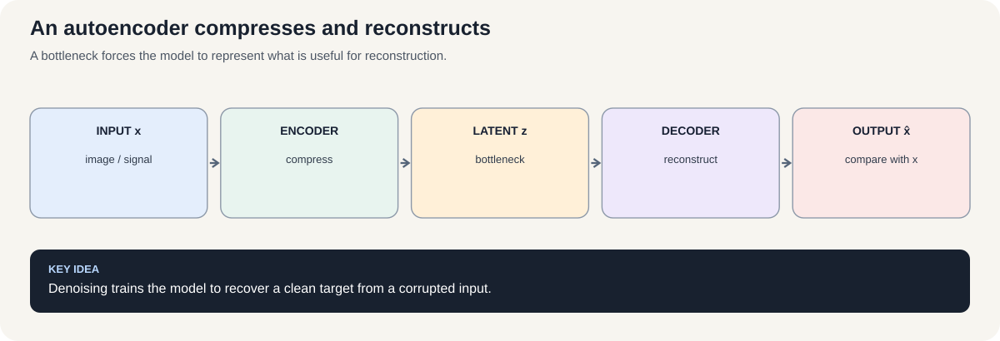
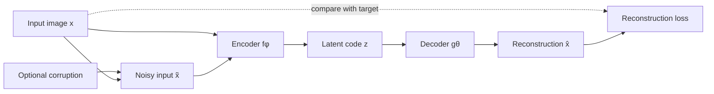

# Course 1 · Chapter — Autoencoders: Learning Useful Representations

**Course:** Deep Learning & Neural Computing Foundations  
**Primary laboratory:** [Open the executable laboratory](./lab.ipynb)

## Why this chapter exists

Suppose we remove the label and simply ask a model to compress an image and reconstruct it. What information does it decide to keep?

An autoencoder learns an encoder $z=f_\phi(x)$ and decoder $\hat{x}=g_\theta(z)$. The bottleneck forces the model to represent the input economically.

We then deliberately make the bottleneck too small, add noise, and inspect what the representation loses.

## Learning objective

By the end of this unit, the learner should be able to explain the mechanism mathematically, implement a minimal version without a high-level abstraction, use a modern library implementation, and design a controlled experiment showing when the method helps or fails.

## Teaching walkthrough

Begin with compression. Suppose an image has 784 pixel values but the important structure lies on a much smaller manifold. An autoencoder learns
z = f_θ(x),  x̂ = g_φ(z)
and minimizes a reconstruction loss such as
L = ||x-x̂||².

The encoder is forced to preserve information useful for reconstruction; the bottleneck controls how much information can pass.

Work through a tiny 4-dimensional example compressed to 2 dimensions. Explain why a linear autoencoder is closely related to principal-component analysis, while nonlinear activations let the learned representation bend around nonlinear structure.

Then distinguish variants:
- sparse: encourage only a small number of latent activations;
- denoising: reconstruct clean x from corrupted x̃;
- contractive: penalize sensitivity to small input changes;
- stacked: compose multiple encoder/decoder layers.

Real connection: anomaly detection, representation learning, dimensionality reduction, denoising, and pretraining.

Failure experiment: make the bottleneck too wide. Reconstruction may become excellent while the latent representation becomes less useful. Then corrupt the input and compare ordinary and denoising autoencoders.

## Build the intuition before the notation

Think about packing a large suitcase into a tiny box.

You cannot preserve everything. You must decide what information is worth keeping.

The encoder is the packing process. The latent vector is the small box. The decoder is the unpacking process.

The reconstruction loss tells the model whether the unpacked result still resembles the original.

### Why the bottleneck is the interesting part

If the latent vector is almost as large as the input and the network is powerful enough, the task can become easy copying.

If the latent vector is tiny, the model must discover regularities.

So the most informative experiment is not simply “train an autoencoder.”

It is:

**change the information bottleneck while keeping the rest of the protocol controlled.**

### Reconstruction versus representation

Suppose two models have:

- Model A: MSE = 0.010, linear-probe accuracy = 82%;
- Model B: MSE = 0.015, linear-probe accuracy = 94%.

Model B reconstructs worse but may provide a better representation for classification.

This is why a research report should never equate reconstruction quality with representation quality without measuring the downstream objective.

### Denoising as an inductive bias

When the input is corrupted but the target remains clean, the model is rewarded for recovering stable structure.

That changes the question from:

> “How do I copy this exact input?”

to:

> “What structure survives plausible corruption?”

This idea will later reappear in many forms of self-supervised learning.

## Work a small example by hand

Take a clean four-value signal \(x=[1,0,1,0]\). Imagine an encoder that averages the two even-position values and the two odd-position values:

\[
z_1=\tfrac12x_1+\tfrac12x_3=1,
\qquad
z_2=\tfrac12x_2+\tfrac12x_4=0.
\]

The latent code is \(z=[1,0]\): four values have been reduced to two. A matching decoder can reconstruct the repeated pattern \([1,0,1,0]\). This example is deliberately simple; a trained network must learn useful compression from many examples rather than being handed the right mapping.

Now consider denoising. Let the clean target be \(x=[1,0,1,0]\), but the corrupted input be \(\tilde{x}=[1,0.1,0.9,0]\). If a model reconstructs \(\hat{x}=[1,0.05,0.95,0]\), its mean squared error against the clean target is

\[
\mathrm{MSE}=\frac{(1-1)^2+(0-0.05)^2+(1-0.95)^2+(0-0)^2}{4}
=0.00125.
\]

Notice the target: the model is scored against the **clean** signal, not the corrupted input. Otherwise, copying the noise could be rewarded.

### What does the bottleneck actually guarantee?

Nothing magical. A narrow latent space limits the number of values passed through, but a high-capacity decoder can still learn shortcuts, and reconstruction quality does not guarantee useful semantic features. Test representation quality separately—for example, freeze the encoder and train a small linear classifier on its latent vectors.

For centered data, a linear autoencoder trained with squared reconstruction error can recover the same principal subspace as PCA under standard conditions. Nonlinear encoders can model more complex structure, but their latent coordinates are not automatically interpretable.

**Check yourself:** if the latent dimension grows from 2 to 64 while the input has 64 values, what failure mode becomes easier? Name one metric beyond reconstruction MSE that could test whether the representation is useful.

## Core concepts

This unit covers **basic, regularized, sparse, denoising, stacked denoising, contractive objectives**. Do not memorize the architecture. Derive the computation, identify its inductive bias, and ask what evidence would distinguish its claimed advantage from a larger parameter count or better optimization.

## Required practical workflow

1. Load the real dataset in the lab and record its provenance, split, schema, license/access basis, and revision/date.
2. Build the smallest defensible baseline.
3. Implement the central mechanism once from first principles.
4. Run the framework implementation.
5. Keep the primary budget fixed while changing one factor.
6. Measure quality, compute, memory, and failure modes.
7. Repeat with seeds when feasible and report uncertainty.
8. Inspect qualitative examples—not only aggregate metrics.
9. Write a short interpretation that separates observation from explanation.
10. Propose the next falsifiable experiment.

## Research exercise

The lab must end with a research question. A good question has a measurable independent variable, a defined outcome, a baseline, and a reason the result would matter. Examples include:

- Does the mechanism improve accuracy at the same parameter count?
- Does it improve sample efficiency at the same training budget?
- Does it improve robustness under distribution shift?
- Does it reduce inference memory or latency?
- Which failure mode becomes more or less common?

## Paper-ready deliverable

Every learner produces a **mini research package**: hypothesis, related-work note, dataset card, method description, experiment matrix, baseline, results table, one figure, error analysis, limitations, reproducibility block, and next-work proposal. These artifacts accumulate toward the final publication capstone.

## Exit questions

1. What problem does the method solve?
2. What inductive bias does it introduce?
3. Which tensor operations implement it?
4. What is the simplest credible baseline?
5. Which metric and split answer the research question?
6. What failure would falsify your hypothesis?

## Visual intuition

*Figure: A bottleneck forces the model to represent what is useful for reconstruction.*

— compression and reconstruction

An autoencoder is trained to reproduce its input after passing through a latent representation. The bottleneck forces the model to compress; denoising changes the task so the input is corrupted but the target remains clean.

**Important distinction:** a small reconstruction error means the input can be reconstructed under this setup. It does not automatically mean the latent code is useful for classification, retrieval, or generation. Those claims need separate tests.

## Laboratory — run the experiment end to end

**[Open the executable laboratory](./lab.ipynb)**

This notebook is part of the chapter, not optional homework. Follow the same scientific loop used in real ML work:

**predict → establish a baseline → run → change one factor → measure → inspect failures → produce the results table → conclude → propose the next experiment.**

The notebook uses a real dataset or environment, records quantitative results, and ends with an answer key and a research extension.

## Video companions

[Video companions: autoencoders and representation learning](https://www.youtube.com/results?search_query=autoencoders+representation+learning+lecture)

## Navigation

[← Previous](../04_convolutional_networks/lecture.md) · [Course 1 home](../README.md) · [Next →](../06_generative_models/lecture.md)
