# Course 1 · Chapter — Generative Models: VAE, GANs, and Diffusion

**Course:** Deep Learning & Neural Computing Foundations  
**Primary laboratory:** [Open the executable laboratory](./lab.ipynb)

## Why this chapter exists

A classifier answers 'which class?'; a generative model asks 'what could a new example look like?' This is the foundation behind synthetic images, speech generation, molecule design, and modern media systems.

VAE, GAN, and diffusion models solve related problems with very different mechanisms. We will build the intuition before comparing their objectives and engineering trade-offs.

The lab emphasizes measurable quality, diversity, and compute rather than attractive sample galleries alone.

## 1. The problem: learning a distribution, not only a label

A classifier learns a mapping

$$
x \rightarrow y.
$$

A generative model instead tries to learn enough about the data distribution to produce new samples:

$$
z \rightarrow x.
$$

The central question is: **what does it mean for a generated example to be plausible?**

## 2. Three different answers

### VAE: structured latent-variable learning

An encoder produces an approximate posterior

$$
q_\phi(z\mid x)=\mathcal N\left(\mu_\phi(x),\operatorname{diag}(\sigma_\phi^2(x))\right).
$$

The reparameterization trick is

$$
z=\mu_\phi(x)+\sigma_\phi(x)\\odot\epsilon,
\qquad
\epsilon\sim\mathcal N(0,I).
$$

The objective is

$$
\mathcal L=
\mathbb E_{q_\phi(z\mid x)}[\log p_\theta(x\mid z)]
-D_{\mathrm{KL}}(q_\phi(z\mid x)\|p(z)).
$$

The first term rewards reconstruction; the second regularizes the latent distribution.

### GAN: adversarial distribution matching

A discriminator tries to distinguish real data from generated data while the generator tries to fool it:

$$
\min_G\max_D
\mathbb E_{x\sim p_{data}}[\log D(x)]
+
\mathbb E_{z\sim p(z)}[\log(1-D(G(z)))].
$$

Because the two players continuously change one another's objective, optimization can be unstable. **Mode collapse** occurs when the generator covers only a narrow part of the data distribution.

### Diffusion: learn iterative denoising

A forward process gradually corrupts data:

$$
q(x_t\mid x_{t-1})
=
\mathcal N\left(
\sqrt{1-\beta_t}x_{t-1},
\beta_t I
\right).
$$

The learned reverse process attempts to remove that corruption step by step.

## 3. Worked comparison

Imagine generating handwritten digits.

A VAE may generate smooth but blurry digits because likelihood and latent regularization favor a broad reconstruction distribution.

A GAN may generate sharp digits but repeatedly produce similar examples.

A diffusion model can generate diverse, high-fidelity examples but usually requires multiple denoising steps at inference.

Therefore there is no universal “best generator.” The application may prioritize fidelity, diversity, controllability, latency, or compute.

| Method | Main strength | Typical failure | Systems consequence |
|---|---|---|---|
| VAE | Structured latent space | Blurry reconstruction / posterior collapse | Relatively simple sampling |
| GAN | Sharp samples | Instability / mode collapse | Adversarial training |
| Diffusion | Fidelity and diversity | Sampling cost | Iterative generation |

## 4. What to measure

Do not rely only on a visual gallery.

Measure:

- reconstruction error for a VAE;
- diversity and mode coverage for a GAN;
- denoising error for diffusion;
- sampling time;
- parameter count;
- memory usage.

A model that improves a quality metric by 1% but multiplies inference cost by 20× may be the wrong engineering choice.

## 5. Failure analysis

If a VAE reconstructs poorly, distinguish insufficient capacity from excessive KL regularization.

If a GAN loses modes, inspect diversity rather than only generator/discriminator losses.

If diffusion remains noisy, distinguish a weak denoiser from an unsuitable noise schedule.

## 6. Laboratory

**[Open the executable laboratory](./lab.ipynb).**

Predict first. Then run the VAE, inspect the diffusion corruption process, and study GAN instability on a toy distribution. The notebook produces quantitative tables and an answer key.

## 7. Research extension

Choose one variable:

- VAE latent dimension;
- VAE KL weight;
- GAN discriminator/generator update ratio;
- diffusion number of steps.

State the hypothesis before the intervention and report quality **and** compute.

## Mastery questions

1. Why does a VAE need the KL term?
2. Why can GAN training become unstable?
3. What is mode collapse?
4. Why does diffusion trade sampling speed for iterative denoising?

### Answers

1. It regularizes the learned latent distribution toward a prior.
2. The generator and discriminator continually move each other's optimization target.
3. The generator covers only a subset of the data distribution.
4. Each reverse step performs part of the learned denoising trajectory.

[← Previous](../05_autoencoders/lecture.md) · [Course 1 home](../README.md) · [Next →](../07_recurrent_networks/lecture.md)

## Build the intuition before the notation

Generative modeling is easiest to understand by asking a simple question:

> **If I only show you examples from a distribution, can you learn to produce new examples that belong to that distribution?**

A classifier learns a decision boundary or conditional prediction. A generator tries to model the structure of the examples themselves.

### VAE: compress, regularize, reconstruct

A VAE does not simply choose one latent vector. It learns a distribution over plausible latent explanations.

The encoder produces $\mu$ and $\sigma$, we sample with

$
z=\mu+\sigma\odot\epsilon,
\qquad \epsilon\sim\mathcal N(0,I),
$

and decode $z$.

The KL term prevents every input from inventing an unrelated private latent space.

### GAN: learn through a game

The discriminator asks:

> “Does this look real?”

The generator asks:

> “Can I produce something the discriminator accepts?”

The difficulty is that both objectives move during training. A generator can also discover an easy subset of the distribution and repeatedly produce similar examples: **mode collapse**.

### Diffusion: learn to reverse corruption

Diffusion takes a different route.

Instead of asking a network to generate a clean sample in one jump, it trains a denoiser to reverse a controlled corruption process.

The conceptual loop is:

**clean data → add noise → learn to remove noise → repeat many times during generation.**

### Fair comparison

Do not compare a VAE, GAN, and diffusion model using only the prettiest generated image.

A serious comparison asks:

- quality;
- diversity;
- coverage;
- conditioning/control;
- inference latency;
- memory;
- training cost.

Different applications optimize different points on this trade-off surface.

## Research exercise

Choose one controlled variable and make a prediction before running the lab.

| Model | Intervention | Primary measurement |
|---|---|---|
| VAE | latent size / KL weight | reconstruction + latent quality |
| GAN | update ratio | stability + diversity |
| Diffusion | denoising steps | quality + sampling time |

Report both **what changed** and **what did not change**.

## Exit questions

1. What makes a model generative rather than merely predictive?
2. Why does a VAE use a latent distribution?
3. Why can GAN training collapse to a few modes?
4. Why does diffusion require repeated denoising?
5. Why should quality and compute be reported together?

## Visual intuition

*Figure: Different training objectives lead to different ways of sampling new examples.*

```mermaid
flowchart TB
    subgraph VAE["Variational autoencoder"]
      X1["Data x"] --> ENC["Encoder predicts μ, σ"]
      ENC --> Z1["Sample latent z"]
      Z1 --> DEC["Decoder"]
      DEC --> XH["Reconstruction x̂"]
      X1 -. "reconstruction + KL objective" .-> OBJ1["Optimize ELBO"]
      XH --> OBJ1
    end
    subgraph GAN["Generative adversarial network"]
      Z2["Random noise z"] --> G["Generator"]
      G --> FAKE["Fake sample"]
      REAL["Real sample"] --> D["Discriminator"]
      FAKE --> D
      D --> OBJ2["Adversarial feedback"]
      OBJ2 --> G
    end
    subgraph DIFF["Diffusion"]
      CLEAN["Clean data x₀"] --> NOISE["Gradually add noise"]
      NOISE --> XT["Noisy xₜ"]
      XT --> DEN["Learn to predict noise / denoise"]
      DEN --> SAMPLE["Reverse steps generate samples"]
    end
```

— three different generative strategies

These methods all model how data can be generated, but their learning signals differ.

The VAE balances reconstruction with a latent-distribution constraint; a GAN learns through a two-player objective; diffusion learns a denoising process that can be run backward to generate samples. Their losses and failure modes should not be compared as if they measured the same thing.

## Laboratory — run the experiment end to end

**[Open the executable laboratory](./lab.ipynb)**

This notebook is part of the chapter, not optional homework. Follow the same scientific loop used in real ML work:

**predict → establish a baseline → run → change one factor → measure → inspect failures → produce the results table → conclude → propose the next experiment.**

The notebook uses a real dataset or environment, records quantitative results, and ends with an answer key and a research extension.

## Video companions

[Video companions: VAE / GAN / diffusion](https://www.youtube.com/results?search_query=VAE+GAN+diffusion+deep+learning)

## Navigation

[← Previous](../05_autoencoders/lecture.md) · [Course 1 home](../README.md) · [Next →](../07_recurrent_networks/lecture.md)
