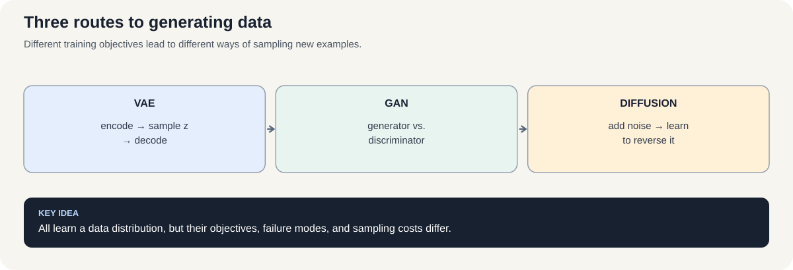

# Course 1 · Chapter 6 — Generative Models: VAE, GANs, and Diffusion

**Course:** Deep Learning & Neural Computing Foundations  
**Primary laboratory:** [Open the executable laboratory](./lab.ipynb)

## Why this chapter exists

A classifier predicts a label or target for an input. A generative model tries to learn enough about the structure of examples to produce new ones. This underlies image synthesis, speech generation, molecule design, simulation, and many modern media systems.

Variational autoencoders (VAEs), generative adversarial networks (GANs), and diffusion models all generate samples, but their learning signals are fundamentally different. By the end of this chapter, you should be able to explain each objective in plain language, calculate a tiny example, identify a characteristic failure, and choose evaluation metrics that do not confuse model loss with sample quality.

## 1. What does it mean to model data?

Let $x$ be an example, such as an image of a handwritten digit. A classifier might learn a conditional prediction $p(y\mid x)$. A generative model instead tries to represent aspects of the data distribution $p_{\mathrm{data}}(x)$ so that it can produce a new plausible example.

The phrase **plausible example** has several meanings. A sample can look realistic but represent only one narrow kind of example. It can be diverse but low fidelity. It can be high quality but take too long to generate. So “best” always depends on the application.

A useful comparison keeps at least three questions separate:

- **Fidelity:** do generated samples resemble valid examples?
- **Coverage / diversity:** does the model represent the important varieties in the data?
- **Cost:** what training time, memory, and inference latency are required?

## 2. VAE: learn a latent distribution

A variational autoencoder has an encoder and decoder, but the encoder predicts a distribution over latent codes rather than just one code. A common Gaussian encoder is

$$
q_\phi(z\mid x)=\mathcal N\left(\mu_\phi(x),\mathrm{diag}(\sigma_\phi^2(x))\right).
$$

Here $\mu_\phi(x)$ is the predicted mean and $\sigma_\phi(x)$ describes uncertainty in each latent coordinate. To sample while keeping the operation differentiable, use the reparameterization trick:

$$
z=\mu_\phi(x)+\sigma_\phi(x)\odot\epsilon,
\qquad \epsilon\sim\mathcal N(0,I).
$$

The random noise $\epsilon$ is sampled independently of the encoder parameters. The network can therefore learn how to change the mean and scale while the randomness remains an explicit input.

### The VAE objective: why are there two terms?

The evidence lower bound (ELBO) for one example is

$$
\mathrm{ELBO}
=
\mathbb E_{q_\phi(z\mid x)}[\log p_\theta(x\mid z)]
-
D_{\mathrm{KL}}\left(q_\phi(z\mid x)\|p(z)\right).
$$

Training can **maximize** this expression. Many implementations instead minimize its negative, which can be written as reconstruction cost plus a latent-distribution penalty:

$$
\mathcal L_{\mathrm{VAE}}
=
\mathcal L_{\mathrm{recon}}
+
\beta D_{\mathrm{KL}}\left(q_\phi(z\mid x)\|p(z)\right).
$$

For the standard ELBO, $\beta=1$; choosing another $\beta$ changes the trade-off and is often called a beta-VAE objective. The reconstruction term rewards explaining the observed example. More precisely, for the likelihood-based ELBO, the minimized reconstruction cost is $\mathcal L_{\mathrm{recon}}=-\mathbb E_{q_\phi(z\mid x)}[\log p_\theta(x\mid z)]$; pixel MSE or binary cross-entropy is used when it matches the chosen observation model. The KL divergence penalizes an encoder distribution that strays too far from the prior $p(z)$, commonly a standard normal distribution. The prior makes it possible to sample a latent vector and decode it without first choosing a training example.

**Numerical example.** Suppose the reconstruction cost is 10 and the KL penalty is 2. With $\beta=0.5$, the minimized objective is

$$
\mathcal L=10+0.5(2)=11.
$$

If $\beta$ increases, the latent constraint becomes stronger. That may produce a more regular latent space, but reconstruction may worsen. If the latent penalty dominates, the encoder can stop conveying useful information—a failure often called *posterior collapse*. The objective is a trade-off, not a direct image-quality score.

## 3. GAN: learn through an adversarial game

A GAN has two networks:

- the **generator** $G$ maps random noise $z$ to a synthetic example $G(z)$;
- the **discriminator** $D$ estimates whether an example came from the real data rather than the generator.

The original minimax objective is

$$
\min_G\max_D
\mathbb E_{x\sim p_{\mathrm{data}}}[\log D(x)]
+
\mathbb E_{z\sim p(z)}[\log(1-D(G(z)))].
$$

The discriminator wants high scores for real examples and low scores for generated examples. The generator wants generated examples to be accepted. Because each network changes while the other is learning, the optimization target moves throughout training.

### Read a GAN loss numerically

For one real example and one generated example, the discriminator's binary-cross-entropy loss can be written

$$
\mathcal L_D=-\log D(x)-\log(1-D(G(z))).
$$

Suppose $D(x)=0.9$ and $D(G(z))=0.2$. Then

$$
\mathcal L_D=-\log(0.9)-\log(0.8)\approx0.329.
$$

If the discriminator instead assigns $D(G(z))=0.9$, the loss becomes

$$
-\log(0.9)-\log(0.1)\approx2.408.
$$

A commonly used non-saturating generator loss for that generated example is $\mathcal L_G=-\log D(G(z))$. At $D(G(z))=0.2$, it is about $1.609$; at $D(G(z))=0.9$, it is about $0.105$.

These calculations explain the current training signal; they do **not** prove that the generator has learned the whole distribution. A generator might produce a few convincing samples repeatedly and ignore other modes. This is **mode collapse**. A low generator loss or a high discriminator score on selected samples is not enough to establish diversity.

## 4. Diffusion: learn to reverse a corruption process

Diffusion models gradually add noise to training data, then train a neural network to predict the noise or another equivalent denoising target. Define $\beta_t$ as the noise variance schedule and $\alpha_t=1-\beta_t$. The cumulative product is

$$
\bar\alpha_t=\prod_{s=1}^{t}\alpha_s.
$$

The forward process has a convenient direct expression:

$$
x_t=\sqrt{\bar\alpha_t}x_0+
\sqrt{1-\bar\alpha_t}\,\epsilon,
\qquad \epsilon\sim\mathcal N(0,I).
$$

Here $x_0$ is the clean example and $x_t$ is the noisy version at step $t$. A common training objective asks a model $\epsilon_\theta(x_t,t)$ to predict the noise:

$$
\mathcal L_{\mathrm{noise}}
=
\mathbb E_{x_0,t,\epsilon}
\left[
\left\|\epsilon-\epsilon_\theta(x_t,t)\right\|_2^2
\right].
$$

**Tiny calculation.** Choose $\bar\alpha_t=0.64$, clean scalar $x_0=1$, and sampled noise $\epsilon=-0.5$. Then

$$
x_t=\sqrt{0.64}(1)+\sqrt{0.36}(-0.5)
=0.8-0.3=0.5.
$$

The model learns how to predict the corruption at different noise levels. During generation, it starts from noise and repeatedly applies a learned reverse update. More denoising steps can improve quality in some settings, but generally increase latency; the precise trade-off depends on the sampler, model, and task.

## 5. Compare mechanisms, not just names

| Model | Learning signal | Common strength | Characteristic failure or cost |
|---|---|---|---|
| VAE | Reconstruction likelihood plus KL regularization | Structured latent representation and straightforward sampling | Blurry outputs in some setups; posterior collapse |
| GAN | Generator–discriminator adversarial game | Can produce sharp samples | Unstable training and mode collapse |
| Diffusion | Predict noise or an equivalent denoising target | Strong sample fidelity and diversity in many applications | Iterative sampling can be expensive |

Do not compare a VAE reconstruction loss, a GAN discriminator loss, and a diffusion noise-prediction loss as if they were on one common scale. Each objective measures a different training task. Use task-appropriate sample metrics, diversity or coverage measures, qualitative inspection, and resource measurements.

## 6. Evaluation: how do we know generation improved?

A sound generative-model evaluation uses multiple kinds of evidence because reconstruction, likelihood, sample quality, diversity, and downstream utility answer different questions.

- **Fidelity:** inspect representative samples and use a metric suitable for the data type.
- **Coverage:** for a toy two-mode distribution, count how often samples fall near each real mode. For complex images, use suitable distributional measures and explain their limitations.
- **Reconstruction:** useful for a VAE, but not a substitute for evaluating newly generated samples.
- **Compute:** record training steps, wall-clock time, peak memory, and sampling latency.
- **Reproducibility:** repeat across seeds when feasible and report mean and spread, not only the best run.

For example, imagine real data has two equally common clusters. If a generator creates 1,000 samples but 995 fall near the first cluster, a handful of beautiful samples can hide severe coverage failure. Counting samples per cluster exposes the issue. This is a valid teaching metric for the toy distribution, not a universal image-quality metric.

## 7. Failure analysis: diagnose the mechanism

- **VAE reconstruction is poor:** compare model capacity and reconstruction objective before assuming the latent dimension is the only problem. Check whether the KL term overwhelms the reconstruction signal.
- **VAE reconstructions are good but generated samples are poor:** evaluate samples drawn from the prior, not only reconstructions of training examples. Those are different paths through the model.
- **GAN outputs look convincing but repetitive:** measure mode coverage and inspect the distribution of generated features; do not rely on a few hand-picked samples.
- **GAN losses oscillate:** inspect both networks' losses and sample quality over time. Because the objectives compete, one loss alone can be misleading.
- **Diffusion samples remain noisy:** distinguish an undertrained denoiser from a poor noise schedule, a sampler issue, or too few reverse steps.

A failure report should state what evidence supports the diagnosis and what alternative explanation remains possible.

## 8. Laboratory and research extension

**[Open the executable laboratory](./lab.ipynb).** Predict first, then run the VAE experiment, inspect the diffusion corruption process, and study GAN instability on a toy distribution. The notebook should produce quantitative evidence, not only a gallery.

Choose one controlled intervention:

| Model | Intervention | Primary measurements |
|---|---|---|
| VAE | Latent size or KL weight | Reconstruction, prior-sample quality, latent-use diagnostics |
| GAN | Generator/discriminator update ratio | Fidelity, mode coverage, stability |
| Diffusion | Number of denoising steps | Quality, sampling time, memory |

State the hypothesis before running the intervention. Keep the dataset, split, evaluation protocol, and other training settings fixed as far as practical. Report what changed, what did not change, and the limitations of the experiment.

## Mastery questions and answers

1. **What makes a model generative rather than merely predictive?** It learns a way to represent or sample from the structure of the data distribution, rather than only mapping inputs to target labels.
2. **Why does a VAE use a latent distribution?** It provides a regularized latent space from which new examples can be sampled and decoded.
3. **What do the two VAE objective terms do?** Reconstruction rewards explaining the example; KL regularization encourages the encoded distribution to stay near the prior.
4. **Why can GAN training collapse to a few modes?** The generator and discriminator co-adapt, and the generator may find a narrow set of outputs that currently fool the discriminator.
5. **Why does diffusion require repeated denoising?** It learns a reverse process for gradually removing noise, usually applying multiple learned updates during sampling.
6. **Why should quality and compute be reported together?** A quality improvement may be too expensive in latency, memory, or training cost for the target application.
7. **Can we compare the three training losses directly?** No. Their terms and scales differ; use task-appropriate quality, diversity, and resource metrics.

## Visual intuition

*Figure: Different training objectives lead to different ways of sampling new examples.*

```mermaid
flowchart TB
    subgraph VAE["Variational autoencoder"]
      X1["Data x"] --> ENC["Encoder predicts μ, σ"]
      ENC --> Z1["Sample latent z"]
      Z1 --> DEC["Decoder"]
      DEC --> XH["Reconstruction x̂"]
      X1 -. "reconstruction + KL objective" .-> OBJ1["Optimize ELBO"]
      XH --> OBJ1
    end
    subgraph GAN["Generative adversarial network"]
      Z2["Random noise z"] --> G["Generator"]
      G --> FAKE["Fake sample"]
      REAL["Real sample"] --> D["Discriminator"]
      FAKE --> D
      D --> OBJ2["Adversarial feedback"]
      OBJ2 --> G
    end
    subgraph DIFF["Diffusion"]
      CLEAN["Clean data x₀"] --> NOISE["Gradually add noise"]
      NOISE --> XT["Noisy xₜ"]
      XT --> DEN["Learn to predict noise / denoise"]
      DEN --> SAMPLE["Reverse steps generate samples"]
    end
```

The VAE balances reconstruction with a latent-distribution constraint; a GAN learns through a two-player objective; diffusion learns a denoising process that can be run backward to generate samples. Their losses and failure modes should not be compared as if they measured the same thing.

## Laboratory — run the experiment end to end

**[Open the executable laboratory](./lab.ipynb)**

Follow:

**predict → establish a baseline → run → change one factor → measure → inspect failures → produce the results table → conclude → propose the next experiment.**

## Video companions

**Start with the VAE:** [Understanding Variational Autoencoders (VAEs)](https://www.youtube.com/watch?v=HBYQvKlaE0A)

Focused companions for the other mechanisms include:
- [GANs: explanations and implementations](https://www.youtube.com/results?search_query=GAN+generative+adversarial+network+explained)
- [Diffusion models: denoising and reverse sampling](https://www.youtube.com/results?search_query=diffusion+models+denoising+reverse+process+explained)

## Navigation

[← Previous](../05_autoencoders/lecture.md) · [Course 1 home](../README.md) · [Next →](../07_recurrent_networks/lecture.md)
