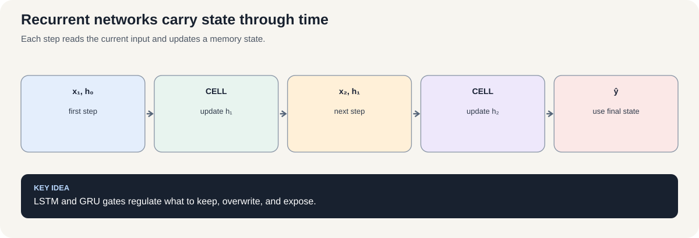
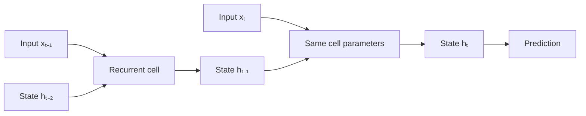
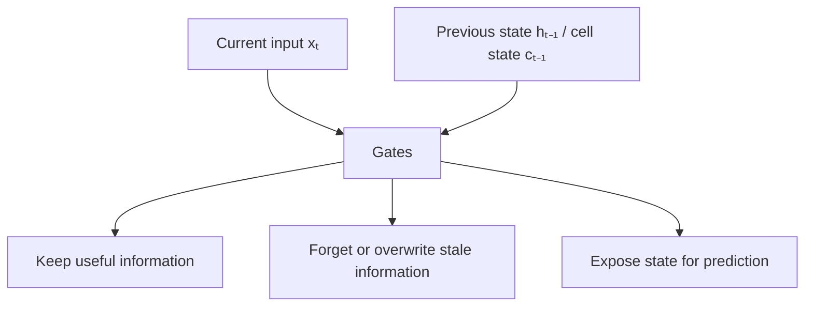

# Course 1 · Chapter — RNNs, LSTM, and GRU: Learning from Sequences

**Course:** Deep Learning & Neural Computing Foundations  
**Primary laboratory:** [Open the executable laboratory](./lab.ipynb)

## Why this chapter exists

Language, sensor streams, transactions, and speech arrive as sequences. A recurrent model carries information from earlier steps into later decisions.

A vanilla RNN repeatedly applies the same transition. LSTM and GRU introduce gates that learn what to keep, forget, and expose, addressing long-range gradient problems.

You will see the failure before learning why the gates were invented.

## Learning objective

By the end of this unit, the learner should be able to explain the mechanism mathematically, implement a minimal version without a high-level abstraction, use a modern library implementation, and design a controlled experiment showing when the method helps or fails.

## Teaching walkthrough

Start with a sequence whose interpretation depends on earlier context. A recurrent model maintains a state:
h_t = φ(W_x x_t + W_h h_{t-1}+b).
The same parameters are reused at every time step.

Unroll the recurrence for three tokens and calculate the hidden state symbolically. This makes an important fact visible: the gradient from a later time step passes through repeated transformations.

Explain vanishing and exploding gradients. If the relevant Jacobian repeatedly shrinks, early information becomes difficult to learn; if it grows, optimization can become unstable.

LSTM introduces gates to control information flow:
i_t = σ(...), f_t = σ(...), o_t = σ(...).
Its cell state provides a more controlled path for long-range information.

GRU simplifies the gating structure while retaining explicit control over updates.

Real connection: speech, forecasting, event streams, and historical sequence models. Transformers later replace recurrence with direct content-based interactions across positions.

Failure experiment: train RNN/LSTM/GRU on a task requiring long-range dependency and measure performance as the dependency length increases.

## Build the intuition before the notation

Imagine reading a sentence one word at a time while carrying a small notebook.

After each word, you update the notebook.

That notebook is the hidden state $h_t$.

An RNN says:

> “Use the current input plus the notebook from the previous step to create the next notebook.”

The difficulty is that the notebook must preserve the right information for potentially hundreds or thousands of steps.

### See the gradient problem numerically

Suppose the relevant gradient factor is approximately $0.8$ at each step.

After 50 steps:

$
0.8^{50}\approx1.43\times10^{-5}.
$

The signal is tiny.

If the factor is $1.2$:

$
1.2^{50}\approx9,100.
$

The signal can become enormous.

These are simplified examples, not exact descriptions of every RNN. Their purpose is to make the words **vanishing** and **exploding** concrete.

### Why gates help

A gate can learn to preserve information rather than repeatedly transforming it.

The LSTM cell-state update

$
c_t=f_t\odot c_{t-1}+i_t\odot\tilde c_t
$

contains an additive path.

If $f_t$ is close to 1 and the new contribution is small, information can persist with much less destructive transformation.

That is the conceptual reason gating helps long-range credit assignment.

### Controlled comparison

Do not compare RNN, LSTM, and GRU using different hidden sizes or different training budgets and then attribute every difference to the architecture.

Keep the important variables fixed, vary the recurrent cell, and repeat across seeds.

## Work a recurrent update by hand

A simple RNN updates its hidden state using the current input and previous state:

[
h_t=\tanh(0.5x_t+0.8h_{t-1}).
]

Let (h_0=0) and feed (x_1=1, x_2=0, x_3=1).

- Step 1: (h_1=\tanh(0.5)\approx0.462).
- Step 2: (h_2=\tanh(0+0.8\times0.462)\approx0.354).
- Step 3: (h_3=\tanh(0.5+0.8\times0.354)\approx0.654).

The second input is zero, but the state remains nonzero because it carries information from the first step. This is useful memory, but it is also a path through which gradients must travel.

### Why long-range learning is hard

If a simplified gradient multiplier is (0.8) at each step, after 10 repeated steps its contribution is (0.8^{10}\approx0.107); after 50 steps it is (0.8^{50}\approx1.43\times10^{-5}). If the multiplier is (1.2), then (1.2^{50}\approx9,100). Repeated shrinkage makes early events hard to learn; repeated growth can destabilize updates. Real RNN gradients involve matrix Jacobians, so these scalar examples illustrate the mechanism rather than model every case.

LSTM introduces a cell-state path:

[
c_t=f_t\odot c_{t-1}+i_t\odot\tilde{c}_t.
]

The forget gate (f_t) controls retained memory; the input gate (i_t) controls new content. When (f_t\) is near 1, information can persist without being repeatedly overwritten. GRU uses a simpler gating design with related goals.

**Check yourself:** if the same input sequence is processed twice from different initial states, should the hidden states necessarily match? Explain which condition would make them match and why this matters when resetting state between independent sequences.

## Core concepts

This unit covers **SRU-style recurrence, LSTM, GRU, sequence modeling and teacher forcing**. Do not memorize the architecture. Derive the computation, identify its inductive bias, and ask what evidence would distinguish its claimed advantage from a larger parameter count or better optimization.

## Required practical workflow

1. Load the real dataset in the lab and record its provenance, split, schema, license/access basis, and revision/date.
2. Build the smallest defensible baseline.
3. Implement the central mechanism once from first principles.
4. Run the framework implementation.
5. Keep the primary budget fixed while changing one factor.
6. Measure quality, compute, memory, and failure modes.
7. Repeat with seeds when feasible and report uncertainty.
8. Inspect qualitative examples—not only aggregate metrics.
9. Write a short interpretation that separates observation from explanation.
10. Propose the next falsifiable experiment.

## Research exercise

The lab must end with a research question. A good question has a measurable independent variable, a defined outcome, a baseline, and a reason the result would matter. Examples include:

- Does the mechanism improve accuracy at the same parameter count?
- Does it improve sample efficiency at the same training budget?
- Does it improve robustness under distribution shift?
- Does it reduce inference memory or latency?
- Which failure mode becomes more or less common?

## Paper-ready deliverable

Every learner produces a **mini research package**: hypothesis, related-work note, dataset card, method description, experiment matrix, baseline, results table, one figure, error analysis, limitations, reproducibility block, and next-work proposal. These artifacts accumulate toward the final publication capstone.

## Exit questions

1. What problem does the method solve?
2. What inductive bias does it introduce?
3. Which tensor operations implement it?
4. What is the simplest credible baseline?
5. Which metric and split answer the research question?
6. What failure would falsify your hypothesis?

## Visual intuition

*Figure: Each step reads the current input and updates a memory state.*

— recurrent state and gated memory

A recurrent network reuses the same cell at each time step. The hidden state carries information forward. LSTM and GRU add gates that control how much information is retained, overwritten, or exposed.

The gates are learned, not manually programmed rules. A fair comparison tests whether the extra gating helps on the chosen sequence task under a comparable data and training budget.

## Laboratory — run the experiment end to end

**[Open the executable laboratory](./lab.ipynb)**

This notebook is part of the chapter, not optional homework. Follow the same scientific loop used in real ML work:

**predict → establish a baseline → run → change one factor → measure → inspect failures → produce the results table → conclude → propose the next experiment.**

The notebook uses a real dataset or environment, records quantitative results, and ends with an answer key and a research extension.

## Video companions

[Video companions: RNNs, LSTM and GRU](https://www.youtube.com/results?search_query=RNN+LSTM+GRU+lecture)

## Navigation

[← Previous](../06_generative_models/lecture.md) · [Course 1 home](../README.md) · [Next →](../08_sequence_architectures_and_forecasting/lecture.md)
