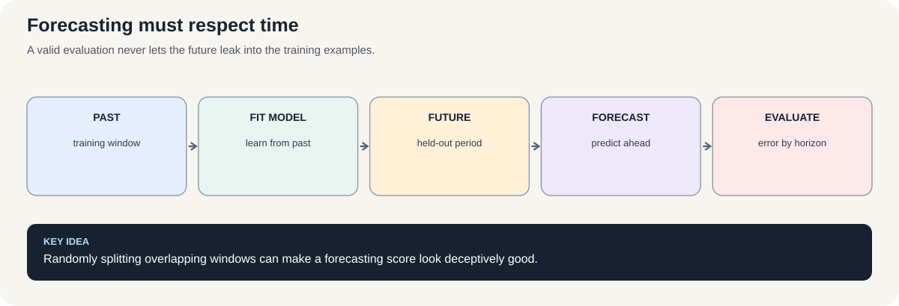
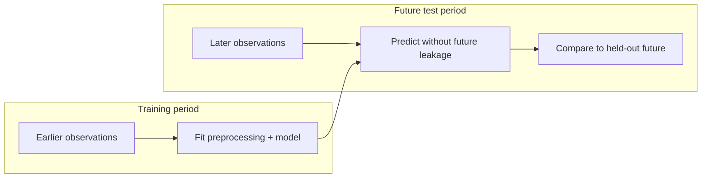

# Course 1 · Chapter 8 — Recurrent Architectures and Time-Series Forecasting

**Course:** Deep Learning & Neural Computing Foundations  
**Primary laboratory:** [Open the executable laboratory](./lab.ipynb)

## Why this chapter exists

Forecasting is a perfect place to learn experimental discipline because time gives us a hard rule: information from the future must never leak into the past.

We compare sequence architectures and build a forecast pipeline with chronological splits, a simple baseline, multi-step prediction, and failure analysis.

The goal is not merely a low error number; it is a trustworthy forecast.

## Learning objective

By the end of this unit, the learner should be able to explain the mechanism mathematically, implement a minimal version without a high-level abstraction, use a modern library implementation, and design a controlled experiment showing when the method helps or fails.

## Teaching walkthrough

Forecasting exposes a critical distinction between fitting a sequence and evaluating a future prediction system.

In an Elman-style network, the hidden state summarizes previous observations. Jordan-style recurrence feeds previous outputs into the state. A fully recurrent architecture can allow richer recurrent connectivity but increases optimization complexity.

For forecasting, suppose the observed history is \(x_1,\ldots,x_t\), and we predict the next value:

\[
(x_1,\ldots,x_t)\longrightarrow \hat{x}_{t+1}.
\]

For a multi-step forecast, we may feed each prediction back into the model:

\[
\hat{x}_{t+1}\longrightarrow \hat{x}_{t+2}\longrightarrow\cdots.
\]

This is called recursive forecasting. If an early prediction is wrong, later predictions use that imperfect value as input, so error can accumulate across the horizon.

Work through a three-step forecast with a simple autoregressive baseline before using a neural network. Explain why a chronological split is mandatory for time series: random splitting can place future information in the training set.

Real connection: electricity demand, traffic, sensors, finance, and operations.

Failure experiment: intentionally randomize the train/test split and compare the apparently excellent result with a proper chronological evaluation. This demonstrates leakage more effectively than a warning paragraph.

## Build the intuition before the notation

Forecasting is a simulation of deployment.

At 9:00 AM, a system can only use information available by 9:00 AM. It cannot use the 9:05 reading merely because that value exists in the dataset.

That simple observation determines the entire evaluation protocol.

### Why random splitting is dangerous

Suppose consecutive windows are:

- window 100: observations 100–123;
- window 101: observations 101–124.

These examples overlap heavily.

A random split can put one in training and the other in test.

The model has then effectively seen part of the test period already.

This is why temporal problems require special care with preprocessing, feature engineering, window creation, and splitting—not merely a different line in train_test_split.

### Forecast horizon changes the task

Predicting one step ahead and predicting eight steps ahead are different problems.

As the horizon increases:

- uncertainty generally grows;
- recursive errors can accumulate;
- useful context can change;
- the best model can change.

Therefore always report performance by horizon instead of only one aggregate number.

### Deployment thought experiment

Before accepting a forecasting result, ask:

> “Could I reproduce every input to this prediction if I froze the world at the exact prediction timestamp?”

If the answer is no, there is likely leakage.

## Work a forecasting split by hand

Suppose the observations are \(10,12,11,15,14,18,17\), and the task is to predict the next value from the previous three. The windows are:

| Input window | Target |
|---|---:|
| \(10,12,11\) | 15 |
| \(12,11,15\) | 14 |
| \(11,15,14\) | 18 |
| \(15,14,18\) | 17 |

The examples overlap because a time-series window reuses recent history. That overlap is not inherently wrong. At a forecast origin, yesterday's observed value is legitimate context for predicting tomorrow. The problem is randomly distributing near-identical windows across train and test, which can make the test set unrealistically similar to the training set.

A safe evaluation protocol defines the forecast cutoff first. Fit using only examples whose **target time** is at or before the cutoff; evaluate on targets after it. When building windows, verify that no feature uses observations that would not have been available at the prediction time.

### Start with a baseline

For many series, the persistence baseline predicts the next value equals the latest observation:

\[
\hat{y}_{t+1}=y_t.
\]

Its mean squared error over \(N\) test targets is

\[
\mathrm{MSE}=\frac1N\sum_{i=1}^N(y_i-\hat{y}_i)^2.
\]

A complex model that cannot beat this simple baseline has not demonstrated value. For multi-step forecasting, recursive prediction feeds each forecast back as an input; early errors can therefore influence later predictions. Plot error by horizon instead of reporting only one averaged score.

**Check yourself:** why is it acceptable for the first test window to contain observations from the training period, but not acceptable for a training label to depend on a future observation beyond the forecast cutoff? Answer in terms of what is known at prediction time.

## Three recurrent layouts, calculated with the same tiny sequence

Use a scalar toy sequence \(x_1=1,\;x_2=2\), a scalar hidden state, and deliberately simple weights. These numbers are chosen for hand calculation; they are not trained parameters.

### Elman recurrence: previous hidden state returns

\[
h_t=\tanh(w_xx_t+w_hh_{t-1}),\qquad y_t=w_yh_t.
\]

Let \(w_x=0.5,\;w_h=0.25,\;w_y=2\), with \(h_0=0\). At the first step,

\[
h_1=\tanh(0.5(1)+0.25(0))=\tanh(0.5)\approx0.462,
\quad y_1\approx0.924.
\]

At the second step, the previous hidden state contributes:

\[
h_2=\tanh(0.5(2)+0.25(0.462))
=\tanh(1.1155)\approx0.806,
\quad y_2\approx1.612.
\]

The hidden state is a learned summary of past inputs. It is not the past observation itself.

### Jordan recurrence: previous output returns

A simple Jordan-style layout feeds the previous output back:

\[
h_t=\tanh(w_xx_t+w_yy_{t-1}),\qquad y_t=w_oh_t.
\]

Let \(w_x=0.5,\;w_y=0.25,\;w_o=2\), and initialize \(y_0=0\). Then

\[
h_1=\tanh(0.5(1)+0.25(0))\approx0.462,\quad y_1\approx0.924,
\]

\[
h_2=\tanh(0.5(2)+0.25(0.924))
=\tanh(1.231)\approx0.843,\quad y_2\approx1.686.
\]

The two outputs differ because the feedback signal differs: Elman uses \(h_{t-1}\); Jordan uses \(y_{t-1}\). Textbooks vary in notation and in whether the output feedback is transformed, so always draw the actual recurrence being implemented.

### Fully recurrent networks: more than one feedback path

In a fully recurrent network, units can connect recurrently to other units—not just through one designated hidden-state vector or output-feedback path. That richer connectivity can represent more interactions, but it also makes the recurrent computation graph and its gradients harder to reason about. The term describes a family of connectivity patterns, not one universally fixed equation. Before implementing one, specify which recurrent edges exist, whether self-connections are allowed, and how the state is updated.

## Preprocessing boundaries are part of the model

For a chronological cutoff \(c\), divide examples by **target timestamp**: training targets satisfy \(t_{\text{target}}\le c\); validation/test targets are later. Then:

1. Fit scalers, imputers, feature selection, and learned encoders using training data only.
2. Apply the fitted transformations to validation/test data without refitting.
3. Build each feature window only from observations available at its forecast origin.
4. If labels or rolling statistics use future values, shift or recompute them so they cannot cross the forecast origin.
5. For repeated evaluation over time, use rolling-origin or expanding-window splits rather than random folds.

A test window may legitimately contain historical observations that were part of the training period: those values would be known at deployment. What must not cross the boundary is information from the target's future or a transformation fitted using the held-out period.

## Core concepts

This unit covers **Elman, Jordan, fully recurrent networks, forecasting protocol, leakage**. Do not memorize the architecture. Derive the computation, identify its inductive bias, and ask what evidence would distinguish its claimed advantage from a larger parameter count or better optimization.

## Required practical workflow

1. Load the real dataset in the lab and record its provenance, split, schema, license/access basis, and revision/date.
2. Build the smallest defensible baseline.
3. Implement the central mechanism once from first principles.
4. Run the framework implementation.
5. Keep the primary budget fixed while changing one factor.
6. Measure quality, compute, memory, and failure modes.
7. Repeat with seeds when feasible and report uncertainty.
8. Inspect qualitative examples—not only aggregate metrics.
9. Write a short interpretation that separates observation from explanation.
10. Propose the next falsifiable experiment.

## Research exercise

The lab must end with a research question. A good question has a measurable independent variable, a defined outcome, a baseline, and a reason the result would matter. Examples include:

- Does the mechanism improve accuracy at the same parameter count?
- Does it improve sample efficiency at the same training budget?
- Does it improve robustness under distribution shift?
- Does it reduce inference memory or latency?
- Which failure mode becomes more or less common?

## Paper-ready deliverable

Every learner produces a **mini research package**: hypothesis, related-work note, dataset card, method description, experiment matrix, baseline, results table, one figure, error analysis, limitations, reproducibility block, and next-work proposal. These artifacts accumulate toward the final publication capstone.

## Exit questions

1. What problem does the method solve?
2. What inductive bias does it introduce?
3. Which tensor operations implement it?
4. What is the simplest credible baseline?
5. Which metric and split answer the research question?
6. What failure would falsify your hypothesis?

## Visual intuition —

*Figure: A valid evaluation never lets the future leak into the training examples.*

architecture is only half the problem

Sequence models differ in how state is passed through time. Forecasting also depends on whether the evaluation mimics deployment: a future prediction must not use information that would only be available later.

A random split can place highly related neighboring windows in both train and test sets, making a model appear better than it will be when forecasting genuinely unseen future periods. For time series, preserve chronological order unless the real deployment problem justifies another protocol.

## Laboratory — run the experiment end to end

**[Open the executable laboratory](./lab.ipynb)**

This notebook is part of the chapter, not optional homework. Follow the same scientific loop used in real ML work:

**predict → establish a baseline → run → change one factor → measure → inspect failures → produce the results table → conclude → propose the next experiment.**

The notebook uses a real dataset or environment, records quantitative results, and ends with an answer key and a research extension.

## Video companions

**Start with the mechanism:** [Recurrent Neural Networks (RNNs), Clearly Explained — StatQuest](https://www.youtube.com/watch?v=AsNTP8Kwu80) (focus on the recurrent state, shared weights, and why long sequences are difficult to train).

For the forecasting protocol, use this [focused video search on chronological splits, baselines, and leakage](https://www.youtube.com/results?search_query=time+series+forecasting+chronological+split+baseline+data+leakage). For gated memory, compare the companion [LSTM explanation from StatQuest](https://www.youtube.com/watch?v=YCzL96nL7j0).

**Viewing question:** Does the example preserve time order, fit preprocessing on the training period only, and compare against a naive forecast? If not, its reported score may not estimate future performance.

## Navigation

[← Previous](../07_recurrent_networks/lecture.md) · [Course 1 home](../README.md) · [Next →](../09_boltzmann_machines/lecture.md)
