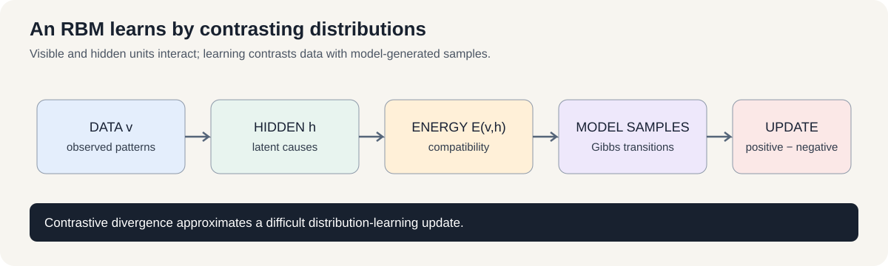
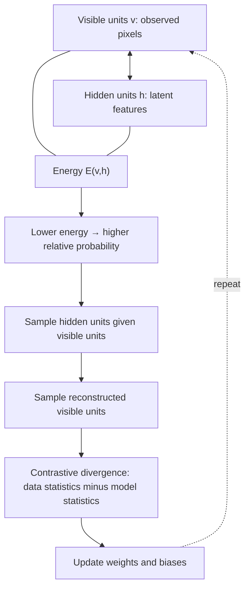

# Course 1 · Chapter — Boltzmann Machines, RBMs, and Deep Belief Networks

**Course:** Deep Learning & Neural Computing Foundations  
**Primary laboratory:** [Open the executable laboratory](./lab.ipynb)

## Why this chapter exists

Before today's dominant neural architectures, researchers explored probabilistic energy-based models that learn which configurations of variables are plausible.

An RBM assigns an energy to visible/hidden configurations and uses alternating conditional sampling. Contrastive divergence makes this practical by approximating the learning signal.

The lab makes the sampling process tangible and shows why approximation and compute matter.

## Learning objective

By the end of this unit, the learner should be able to explain the mechanism mathematically, implement a minimal version without a high-level abstraction, use a modern library implementation, and design a controlled experiment showing when the method helps or fails.

## Teaching walkthrough

Begin with an energy function rather than a neural-network layer. An energy-based model assigns lower energy to configurations it considers more compatible.

For a restricted Boltzmann machine with visible v and hidden h:
E(v,h) = -aᵀv - bᵀh - vᵀWh.
The probability is proportional to exp(-E).

The restriction—no visible-visible or hidden-hidden edges—makes conditional sampling tractable:
P(h_j=1|v)=σ(b_j+W_jv).
Similarly for visible units.

Explain contrastive divergence: start from observed data, sample hidden states, reconstruct visible states, sample again, and use the difference between data and reconstruction statistics as an approximate learning signal.

Deep belief networks stack RBM-like representations.

Real connection: these models are historically important because they illustrate latent-variable learning, energy-based modeling, and pre-deep-learning representation learning.

Failure experiment: compare reconstruction statistics after different numbers of Gibbs steps and observe why approximate sampling can bias learning.

## Build the intuition before the notation

Imagine a landscape where every possible configuration of variables sits at a different height.

The model wants familiar configurations to sit in **valleys** and implausible configurations to sit at **higher energy**.

Learning then changes the landscape so that real data becomes easier for the model to generate.

That is the intuition behind an energy-based model.

### Why sampling appears

For a discriminative classifier, we can often compute a prediction directly.

For an energy-based generative model, we care about a distribution over many possible configurations.

That means we need a way to explore the landscape.

Gibbs sampling is one such exploration process.

### Why contrastive divergence is clever—and imperfect

Starting the chain at real data gives us a useful reference point.

Rather than waiting for the Markov chain to mix perfectly, contrastive divergence takes only a short journey and uses the resulting sample to approximate the negative phase.

This makes training much cheaper.

It also means the learning rule is approximate.

That is a recurring machine-learning engineering trade-off:

**more accurate computation ↔ more compute ↔ potentially better statistical approximation.**

### Research question

The most educational experiment is not “which RBM gets the lowest reconstruction error?”

It is:

> “At a fixed wall-clock budget, how much does additional negative-phase sampling improve the learned model?”

That question connects statistical approximation directly to systems cost.

## Work a tiny energy calculation by hand

For a restricted Boltzmann machine, one common energy function is

\[
E(v,h)=-a^\top v-b^\top h-v^\top Wh,
\]

where \(v\) is the visible vector, \(h\) the hidden vector, \(a,b\) are biases, and \(W\) connects visible to hidden units. Lower energy means the model regards that joint configuration as more compatible.

For a one-visible, one-hidden toy model, set both biases to zero and \(W=1\). Then:

- \(E(1,1)=-1\), because the active visible and hidden units agree through the positive weight;
- \(E(1,0)=0\), because the interaction term is zero.

The unnormalized probability is proportional to \(e^{-E(v,h)}\), so the first configuration receives weight \(e^1\), while the second receives weight \(e^0=1\). This illustrates how the interaction changes relative preference. It is not a full probability calculation over every possible configuration.

### Why contrastive divergence has two phases

The positive phase uses real data to increase compatibility between observed patterns and their likely hidden causes. The negative phase uses model-generated samples to reduce the model's tendency to assign excessive probability to those samples. Contrastive divergence approximates this second phase with a short Gibbs chain; it is computationally convenient but biased.

A falling reconstruction error is useful diagnostic evidence, not proof that the learned distribution is good. Also inspect generated samples, diversity, and stability across random seeds.

**Check yourself:** if the positive and negative phases were identical, what would the expected parameter update be? Explain why the model needs to compare data-driven and model-driven statistics.

## Core concepts

This unit covers **energy-based learning, RBM, contrastive divergence, DBN intuition**. Do not memorize the architecture. Derive the computation, identify its inductive bias, and ask what evidence would distinguish its claimed advantage from a larger parameter count or better optimization.

## Required practical workflow

1. Load the real dataset in the lab and record its provenance, split, schema, license/access basis, and revision/date.
2. Build the smallest defensible baseline.
3. Implement the central mechanism once from first principles.
4. Run the framework implementation.
5. Keep the primary budget fixed while changing one factor.
6. Measure quality, compute, memory, and failure modes.
7. Repeat with seeds when feasible and report uncertainty.
8. Inspect qualitative examples—not only aggregate metrics.
9. Write a short interpretation that separates observation from explanation.
10. Propose the next falsifiable experiment.

## Research exercise

The lab must end with a research question. A good question has a measurable independent variable, a defined outcome, a baseline, and a reason the result would matter. Examples include:

- Does the mechanism improve accuracy at the same parameter count?
- Does it improve sample efficiency at the same training budget?
- Does it improve robustness under distribution shift?
- Does it reduce inference memory or latency?
- Which failure mode becomes more or less common?

## Paper-ready deliverable

Every learner produces a **mini research package**: hypothesis, related-work note, dataset card, method description, experiment matrix, baseline, results table, one figure, error analysis, limitations, reproducibility block, and next-work proposal. These artifacts accumulate toward the final publication capstone.

## Exit questions

1. What problem does the method solve?
2. What inductive bias does it introduce?
3. Which tensor operations implement it?
4. What is the simplest credible baseline?
5. Which metric and split answer the research question?
6. What failure would falsify your hypothesis?

## Visual intuition

— energy and hidden structure

An RBM assigns an energy to a visible/hidden configuration. Training adjusts weights and biases so observed data configurations become more compatible with the model than configurations produced by its own sampling process.

The restricted structure matters: there are no visible-visible or hidden-hidden connections, which makes the conditional distributions easier to sample. Contrastive divergence is an approximation; it is not exact maximum-likelihood training.

## Laboratory — run the experiment end to end

**[Open the executable laboratory](./lab.ipynb)**

This notebook is part of the chapter, not optional homework. Follow the same scientific loop used in real ML work:

**predict → establish a baseline → run → change one factor → measure → inspect failures → produce the results table → conclude → propose the next experiment.**

The notebook uses a real dataset or environment, records quantitative results, and ends with an answer key and a research extension.

## Video companions

**Recommended starting point:** [Boltzmann machines and energy-based learning](https://www.youtube.com/watch?v=_bqa_I5hNAo)

For the training approximation used in RBMs, [explore contrastive divergence and Gibbs sampling](https://www.youtube.com/results?search_query=restricted+Boltzmann+machine+contrastive+divergence+Gibbs+sampling).

## Navigation

[← Previous](../08_sequence_architectures_and_forecasting/lecture.md) · [Course 1 home](../README.md) · [Next →](../10_attention_transformers_and_llms/lecture.md)
