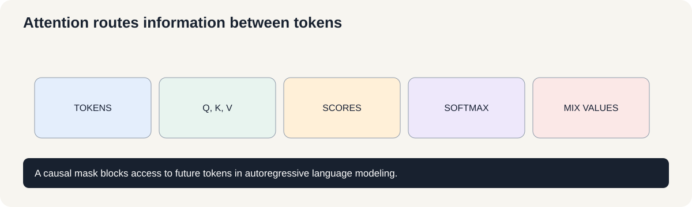
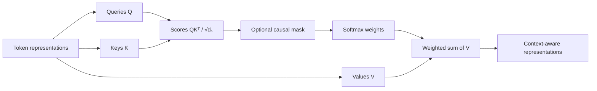

# Course 1 · Chapter — Attention and the Transformer Bridge

**Course:** Deep Learning & Neural Computing Foundations  
**Primary laboratory:** [Open the executable laboratory](./lab.ipynb)

## Why this chapter exists

A recurrent model carries information step by step. Attention lets one position directly consult other positions, making long-range relationships much easier to represent.

Queries ask what a token is looking for; keys describe what each token offers; values contain the information retrieved. The Transformer combines this mechanism with residual paths, normalization, and feed-forward layers.

The causal-mask experiment demonstrates a critical idea: an autoregressive model must not see the future answer.

## Learning objective

By the end of this unit, the learner should be able to explain the mechanism mathematically, implement a minimal version without a high-level abstraction, use a modern library implementation, and design a controlled experiment showing when the method helps or fails.

## Teaching walkthrough

Begin with a sentence containing a long dependency:

“The scientist who had worked in Tehran for ten years finally published the paper.”

Suppose we want the representation of “published” to use information about “scientist.” A recurrent model can carry that information through many steps. Attention asks a different question:

> Which positions should this position directly use right now?

Given queries \(Q\), keys \(K\), and values \(V\), scaled dot-product attention is

\[
\operatorname{Attention}(Q,K,V)=
\operatorname{softmax}\!\left(\frac{QK^\top}{\sqrt{d_k}}\right)V.
\]

Conceptually, \(QK^\top\) scores how strongly each token's query matches each token's key. Dividing by \(\sqrt{d_k}\) controls the scale of those scores as the key dimension grows. Softmax turns each row of scores into nonnegative weights that sum to 1. Multiplying those weights by \(V\) produces a weighted mixture of the information carried by the tokens.

Use a three-token numerical example and calculate one attention row. Then apply a causal mask and show why token \(t\) cannot use future tokens during autoregressive language modeling.

Explain the roles separately:
- Q: what this position is looking for;
- K: what each position offers for matching;
- V: what information is retrieved after matching.

Then introduce multi-head attention as several learned projections that can specialize in different relationships.

The Transformer combines attention with positional information, residual connections, normalization, and feed-forward transformations.

Real connection: machine translation, BERT-style encoders, GPT-style decoders, retrieval, multimodal models.

Failure experiment: remove the causal mask in a next-token training task. The model may appear to learn extraordinarily well because it can see the answer. This is data leakage inside the architecture.

The next course uses this bridge to derive decoder-only LLMs in much greater detail.

## Build the intuition before the notation

Imagine a classroom where every student can ask:

> “Which other student has information useful for my current question?”

The query is the question.

The key is the description of what each student knows.

The value is the information actually retrieved.

Attention performs this matching computationally.

### A three-token mental model

Suppose three tokens have already produced queries, keys, and values.

For one query:

1. compare it with all keys;
2. turn those scores into weights;
3. use those weights to mix the values.

If the weights are $[0.7,0.2,0.1]$, the output is simply:

$
0.7v_1+0.2v_2+0.1v_3.
$

So attention is not magic memory. It is **content-dependent weighted information retrieval inside the sequence**.

### Why the causal mask changes the problem

Without a mask, position 3 can use positions 4, 5, and beyond.

For next-token training, that would expose information that the model is supposed to predict.

With a causal mask, the attention matrix becomes triangular:

$
\begin{bmatrix}
\times&0&0\\
\times&\times&0\\
\times&\times&\times
\end{bmatrix}.
$

The zeros mean “future information is unavailable.”

### From attention to LLMs

The conceptual chain is:

**sequence context → attention → Transformer block → stacked decoder blocks → next-token prediction → pretrained language model → LLM engineering.**

Course 2 begins exactly where this chapter ends.

### Research comparison

Compare full attention with a local-window alternative.

For sequence length $n$, full attention creates roughly $n^2$ pairwise interactions.

That quadratic relationship is one reason efficient-attention research matters.

The important question is not merely “which is faster?” but:

> **What information do we lose when we stop allowing every position to interact with every other position?**

## Work a tiny attention calculation by hand

Suppose one query is \(q=[1,0]\), and two keys are \(k_1=[1,0]\) and \(k_2=[0,1]\). With key dimension \(d_k=2\), scaled dot-product attention gives scores

\[
s_i=\frac{q^\top k_i}{\sqrt{d_k}}
\quad\Rightarrow\quad
s_1=\frac1{\sqrt2}\approx0.707,\qquad s_2=0.
\]

Softmax converts scores to weights:

\[
\alpha_i=\frac{e^{s_i}}{\sum_j e^{s_j}}
\quad\Rightarrow\quad
(\alpha_1,\alpha_2)\approx(0.67,0.33).
\]

Let the corresponding values be \(v_1=[10,0]\) and \(v_2=[0,10]\). The output is their weighted average:

\[
o=0.67v_1+0.33v_2\approx[6.7,3.3].
\]

The output mostly carries the first value because its key matched the query more strongly. In a Transformer, queries, keys, and values are learned projections of token representations, not hand-written vectors.

### What the causal mask changes

When predicting the next token, position \(t\) must not read positions after \(t\). A causal mask replaces forbidden future scores with a very negative number before softmax, making their weights effectively zero. Without the mask, training can leak the answer token into its own prediction.

Attention weights show how a particular head mixes value vectors; they are not automatically faithful explanations of a model's decision.

**Check yourself:** if both scores are equal and neither is masked, what are the two attention weights? What should happen to the weight of a masked future token?

## Core concepts

This unit covers **attention types, Transformer, encoder/decoder, BERT, GPT, bridge to LLM training**. Do not memorize the architecture. Derive the computation, identify its inductive bias, and ask what evidence would distinguish its claimed advantage from a larger parameter count or better optimization.

## Required practical workflow

1. Load the real dataset in the lab and record its provenance, split, schema, license/access basis, and revision/date.
2. Build the smallest defensible baseline.
3. Implement the central mechanism once from first principles.
4. Run the framework implementation.
5. Keep the primary budget fixed while changing one factor.
6. Measure quality, compute, memory, and failure modes.
7. Repeat with seeds when feasible and report uncertainty.
8. Inspect qualitative examples—not only aggregate metrics.
9. Write a short interpretation that separates observation from explanation.
10. Propose the next falsifiable experiment.

## Research exercise

The lab must end with a research question. A good question has a measurable independent variable, a defined outcome, a baseline, and a reason the result would matter. Examples include:

- Does the mechanism improve accuracy at the same parameter count?
- Does it improve sample efficiency at the same training budget?
- Does it improve robustness under distribution shift?
- Does it reduce inference memory or latency?
- Which failure mode becomes more or less common?

## Paper-ready deliverable

Every learner produces a **mini research package**: hypothesis, related-work note, dataset card, method description, experiment matrix, baseline, results table, one figure, error analysis, limitations, reproducibility block, and next-work proposal. These artifacts accumulate toward the final publication capstone.

## Exit questions

1. What problem does the method solve?
2. What inductive bias does it introduce?
3. Which tensor operations implement it?
4. What is the simplest credible baseline?
5. Which metric and split answer the research question?
6. What failure would falsify your hypothesis?

## Visual intuition

— attention is content-dependent routing

Each token produces a query, key, and value. Query-key similarity determines how much each token reads from the others; the weighted sum of values becomes the output. A causal mask prevents a token from reading future positions during next-token prediction.

Attention weights are not automatically explanations of model reasoning. They show the routing weights used in this operation; interpretation requires care and additional evidence.

## Laboratory — run the experiment end to end

**[Open the executable laboratory](./lab.ipynb)**

This notebook is part of the chapter, not optional homework. Follow the same scientific loop used in real ML work:

**predict → establish a baseline → run → change one factor → measure → inspect failures → produce the results table → conclude → propose the next experiment.**

The notebook uses a real dataset or environment, records quantitative results, and ends with an answer key and a research extension.

## Video companions

[Attention in transformers, step-by-step](https://www.youtube.com/watch?v=eMlx5fFNoYc) · [Let's build GPT](https://www.youtube.com/watch?v=kCc8FmEb1nY)

## Navigation

[← Previous](../09_boltzmann_machines/lecture.md) · [Course 1 home](../README.md) · [Next →](../11_deep_reinforcement_learning/lecture.md)
