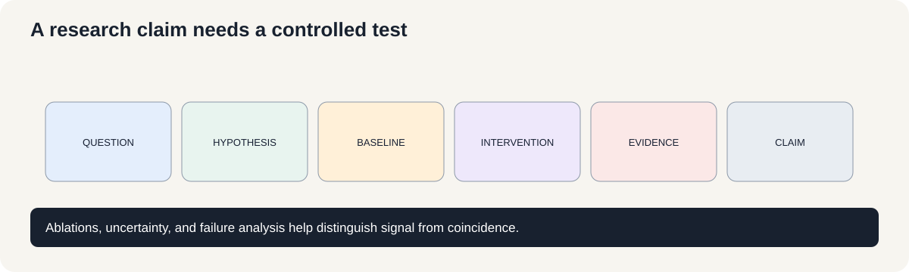
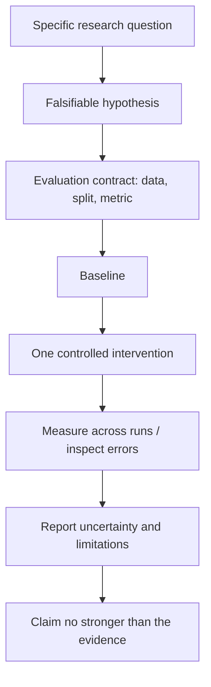

# Course 1 · Chapter 12 — Research Capstone: From Observation to Evidence

**Course:** Deep Learning & Neural Computing Foundations  
**Primary laboratory:** [Open the publication capstone](./lab.ipynb)

## 1. Start with a falsifiable question

“Try a bigger model” is not a research question.

A defensible question identifies an independent variable and measurable outcome:

$$
\text{intervention}
\rightarrow
\text{measurable outcome}.
$$

Example:

> At approximately equal parameter count, does adding a nonlinear hidden representation improve held-out accuracy?

That can be contradicted by evidence.

## 2. Freeze the evaluation contract

Before changing the model, specify:

- dataset and provenance;
- train/validation/test split;
- primary metric;
- baseline;
- intervention;
- compute/training budget;
- seeds;
- stopping rule.

This prevents the evaluation from drifting toward whichever result looks best.

## 3. Observation, explanation, claim

Suppose Model B scores 91% and Model A scores 89%.

**Observation:** B scored higher under the measured protocol.

**Explanation:** perhaps its representation is better, but this is a mechanism hypothesis.

**Claim:** B improves this task under the stated conditions.

Do not silently jump from the first statement to the third.

## 4. Intervention and ablation

A useful experiment has a baseline

$$
B
$$

and a controlled intervention

$$
B+\Delta.
$$

An ablation removes the proposed mechanism while preserving as much else as possible.

If the effect disappears under the ablation, the evidence that the mechanism mattered becomes stronger.

## 5. Uncertainty

For repeated measurements $x_1,\ldots,x_n$, report the mean

$$
\bar{x}=\frac{1}{n}\sum_{i=1}^{n}x_i
$$

and sample standard deviation

$$
s=
\sqrt{
\frac{1}{n-1}
\sum_{i=1}^{n}(x_i-\bar{x})^2
}.
$$

A table containing only the best seed hides important uncertainty.

### Worked uncertainty example

Suppose three independent training seeds produce evaluation scores $89,91,90$ (for example, percentage accuracy). Their mean is

$$
\bar x=\frac{89+91+90}{3}=90.
$$

The sample standard deviation is

$$
s=\sqrt{\frac{(89-90)^2+(91-90)^2+(90-90)^2}{3-1}}=1.
$$

Report this as $90\pm1$ percentage point **with the number of seeds and protocol stated**. Three seeds are a small sample, so this is descriptive evidence, not a guarantee that the true performance lies within one point. The seeds should repeat the relevant sources of randomness; three checkpoints from the same training run are not three independent runs.

### A compact evidence table

| Item | Example entry | Why the reader needs it |
|---|---|---|
| Question | Does convolution help at matched parameter count? | Defines the claim being tested |
| Baseline | Dense classifier, 50k parameters | Gives a reference point |
| Intervention | Local convolutional model, similar parameter budget | Isolates the proposed change |
| Primary metric | Test accuracy on a frozen split | Prevents metric switching |
| Repeats | 3 seeds; mean and standard deviation | Shows variability |
| Limitation | MNIST does not establish robustness on natural images | Bounds generalization |

A paper-ready result should make it possible for another person to reconstruct the comparison and identify what evidence would change the conclusion.

## 6. Error analysis

Aggregate metrics hide mechanisms.

Inspect:

- false positives and false negatives;
- difficult examples;
- distribution-shift failures;
- confidence/calibration;
- resource regressions.

An error table should classify failures by mechanism rather than merely listing examples.

## Failure analysis: common research-design mistakes

- **Changing several things at once:** the result cannot identify which change mattered. Return to one primary intervention or use a factorial design with enough runs.
- **Tuning on the test set:** the test set has become part of model selection. Freeze a fresh test set or obtain a new evaluation set.
- **Reporting only the best seed:** selection favors noise. Report the predeclared aggregate across runs and the full protocol.
- **Claiming a mechanism from a metric alone:** the observation may support several explanations. Add ablations or diagnostics that distinguish them.
- **Using a metric that does not match the claim:** reconstruction error does not prove semantic usefulness; average accuracy may hide minority-group or long-horizon failures.

## 7. Paper-ready structure

A compact research report follows:

**Abstract → Introduction → Related Work → Method → Experimental Setup → Results → Error Analysis → Limitations → Conclusion → Reproducibility.**

A result does not need to be novel to be useful. A careful reproduction, negative result, benchmark, ablation, or efficiency study can be a legitimate research contribution when the question and evidence are clear.

## Build the intuition before the notation

A research project is a chain of decisions.

You start with:

**question → hypothesis → experiment → evidence → interpretation → next question.**

The final model is only one part of the project.

### The hypothesis must be falsifiable

Weak:

> “CNNs are better.”

Strong:

> “At matched parameter count and training budget, a local convolutional inductive bias will improve MNIST accuracy relative to a dense baseline.”

The second statement can lose.

That is good.

### The evaluation contract

Write the evaluation contract **before** looking at the final result:

- exact dataset;
- preprocessing;
- split;
- metric;
- baseline;
- intervention;
- budget;
- seeds;
- stopping rule.

This prevents accidental researcher degrees of freedom from turning into hidden cherry-picking.

### Results are evidence, not explanations

Suppose the intervention improves accuracy.

The result supports:

> “The intervention improved accuracy under this protocol.”

It does not automatically prove:

> “The proposed mechanism caused the improvement.”

That second statement requires stronger controls.

### The capstone report

Your final Course 1 artifact should contain:

1. research question;
2. hypothesis;
3. dataset/provenance;
4. baseline;
5. intervention;
6. experimental controls;
7. results table;
8. uncertainty;
9. qualitative/error analysis;
10. limitations;
11. reproducibility details;
12. next experiment.

### Course 2 readiness

Before moving to LLM engineering, you should be comfortable answering:

- What exactly is the model optimizing?
- What is the baseline?
- What changed between experiments?
- What does the metric actually measure?
- What evidence would falsify your explanation?
- Can another researcher reproduce the experiment?

If you can answer those questions, you have learned the most transferable part of Course 1.

## Final research exercise

Take one experiment from Course 1 and rewrite it as a one-page research proposal.

Include:

**Hypothesis → Dataset → Baseline → Intervention → Metric → Budget → Expected outcome → Failure criterion → Reproducibility plan.**

This becomes the bridge from learning algorithms to doing research on LLMs.

## Visual intuition

— from question to defensible claim

A research result is not just a metric. The claim must follow from the question, the evaluation contract, the controlled comparison, and the uncertainty in the evidence.

A good figure should make the evidence easier to inspect, not decorate the conclusion. Plot the actual observations, label the metric and units, include uncertainty when available, and disclose the experiment conditions.

## Laboratory — run the experiment end to end

**[Open the executable laboratory](./lab.ipynb)**

This notebook is the chapter's final research artifact, not optional homework. Follow the complete research loop: **state a question → freeze the protocol → establish a baseline → intervene → measure → inspect errors → produce the results table → bound the claim → propose the next falsifiable experiment.**

You will leave with a reproducible mini-study rather than a single model score. The final cells contain the answer key and a research extension.

## Mastery questions

1. What makes a research question falsifiable?
2. Why freeze the evaluation contract?
3. What is the difference between observation and explanation?
4. Why are ablations valuable?
5. Why report uncertainty?

### Answers

1. A plausible outcome can be contradicted by a defined measurement.
2. Otherwise the evaluation can drift toward the result that looks best.
3. Observation is what happened; explanation is a proposed mechanism for why.
4. Ablations test whether the proposed mechanism contributes to the observed effect.
5. To distinguish systematic effects from stochastic variation.

## Final Course 1 standard

A learner is ready for Course 2 when they can:

**derive → implement → measure → break → explain → decide → reproduce.**

## Video companions

Use these as methodological companions rather than substitutes for running the experiment:
- [Princeton workshop: The Reproducibility Crisis in ML-based Science](https://sites.google.com/princeton.edu/rep-workshop/) — recorded talks and materials on leakage, evaluation, and reproducibility.
- [Deep learning experiment design, ablations, and reproducibility](https://www.youtube.com/results?search_query=deep+learning+experiment+design+ablation+reproducibility)
- [How to read and critically evaluate machine-learning papers](https://www.youtube.com/results?search_query=how+to+read+machine+learning+research+papers+critically)

**Viewing question:** Which experimental detail would you need to reproduce the claim: data version, split, seed, hyperparameters, compute budget, metric, or code? Identify what the speaker reports and what remains missing.

## Navigation

[← Previous](../11_deep_reinforcement_learning/lecture.md) · [Course 1 home](../README.md) · [Continue to Course 2 →](../../01_what_is_an_llm/lecture.md)
