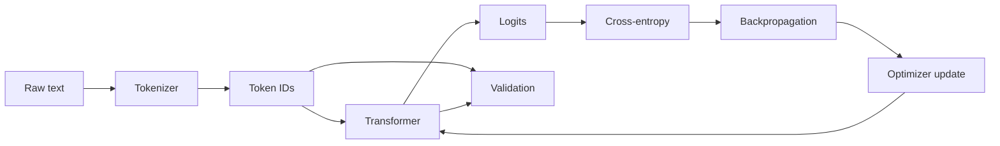
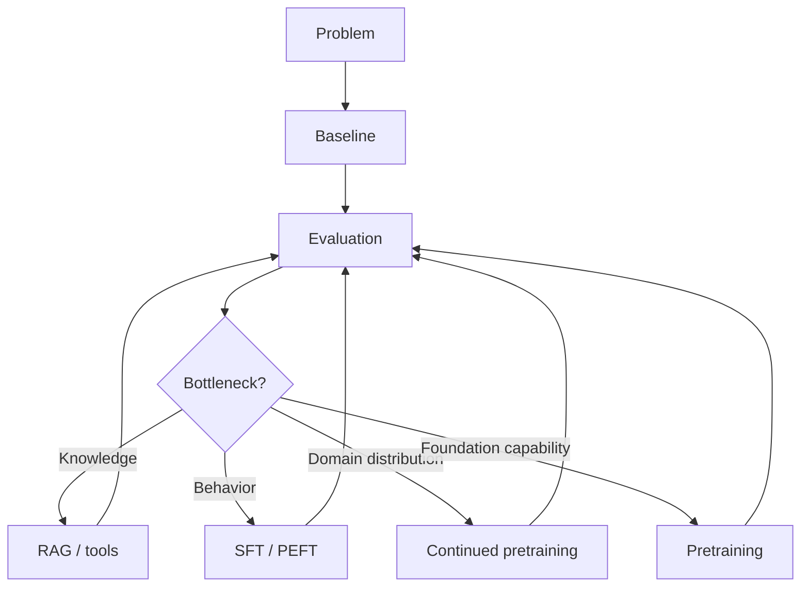
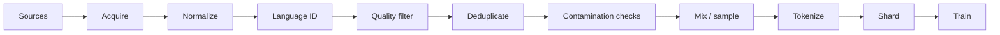
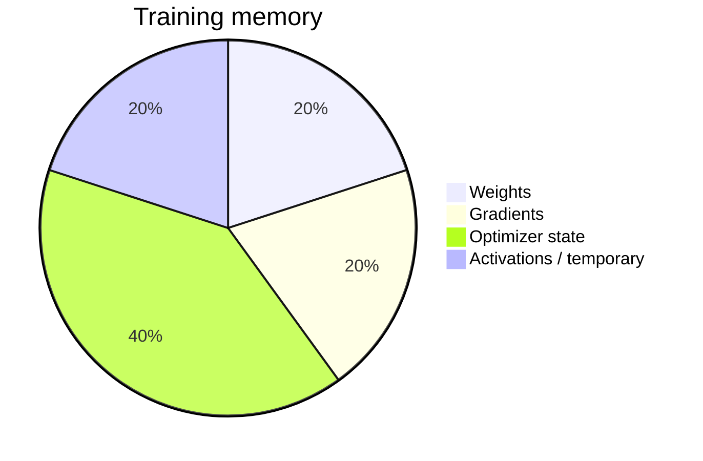
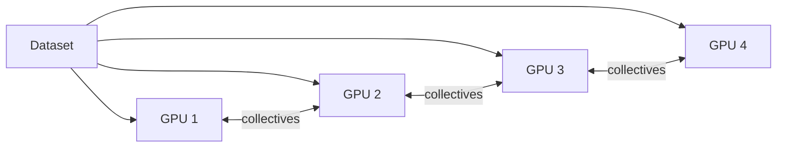
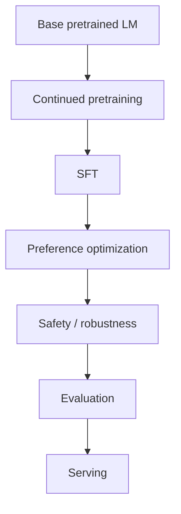
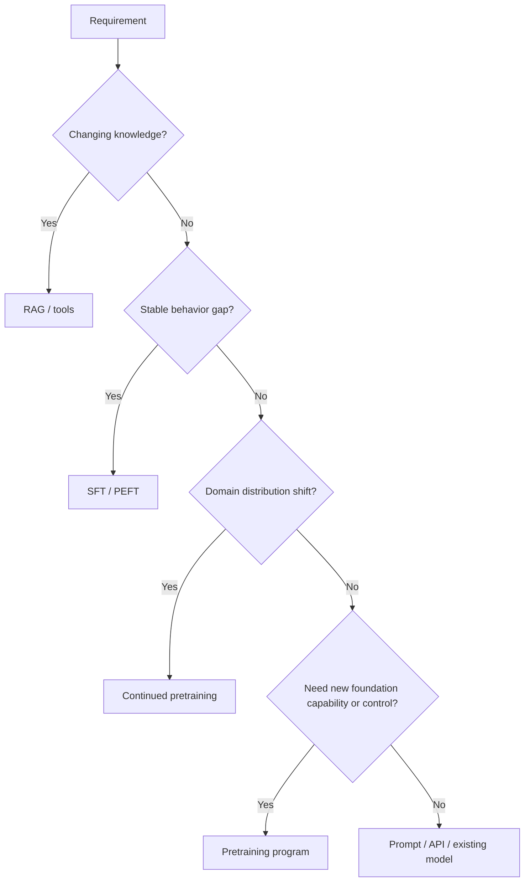
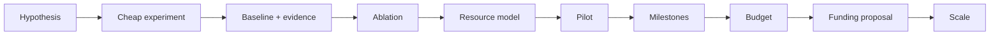

# Core Visuals

These diagrams are meant to be displayed directly on GitHub and reused in lectures, notebooks, proposals, and papers.

## 1. Language-model learning loop

**Notice this:** the model is trained by repeatedly changing parameters so the observed next token becomes more probable.

## 2. Complete model-development lifecycle

**Notice this:** training is one branch of the solution space, not the default answer.

## 3. Pretraining data pipeline

## 4. GPU memory model

The exact proportions depend on precision, optimizer, batch, sequence length, checkpointing, and implementation. The diagram is conceptual.

## 5. Distributed training

Data parallelism is only one dimension. Real large-model systems may combine data, tensor, pipeline, context, and expert parallelism.

## 6. Post-training stack

Not every model needs every stage.

## 7. Build-vs-buy decision

## 8. Evidence-to-funding pipeline

